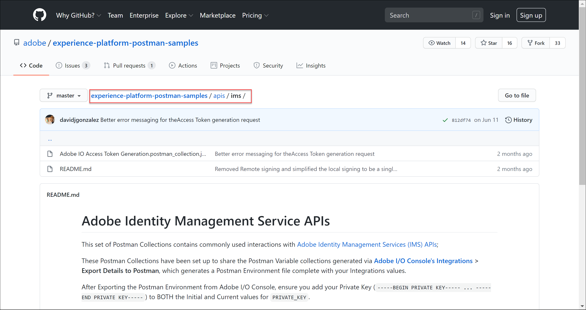
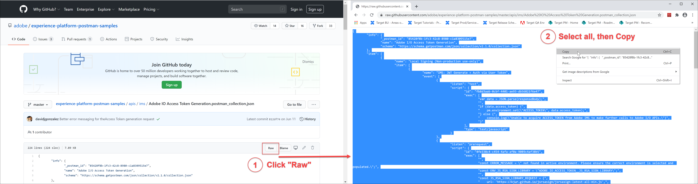
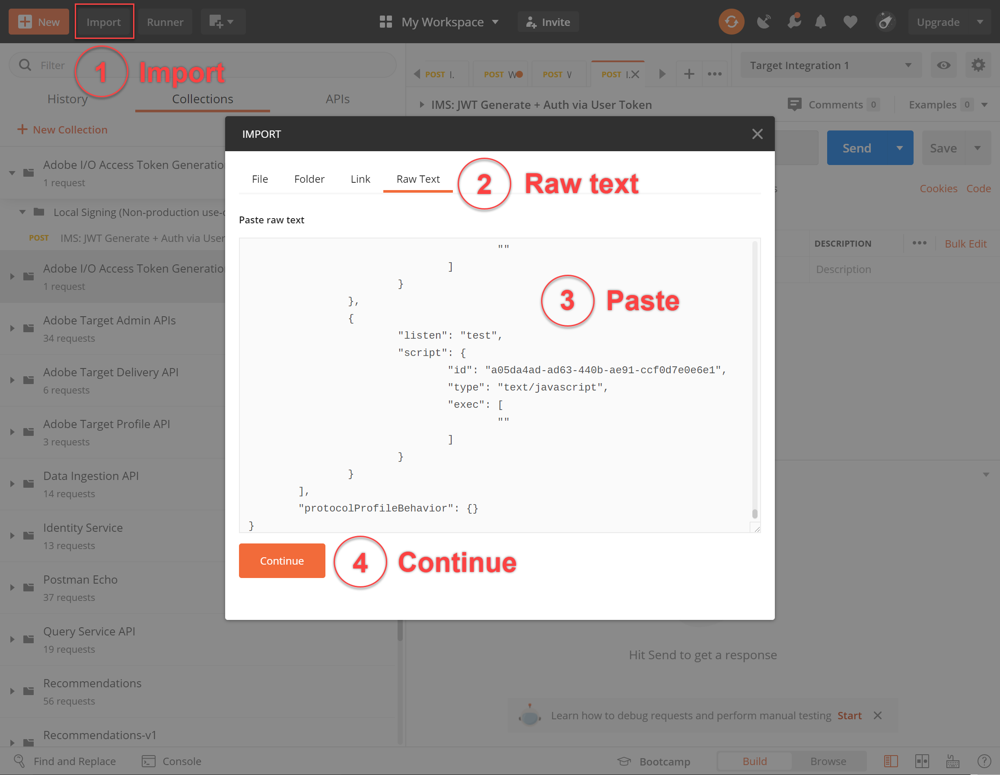
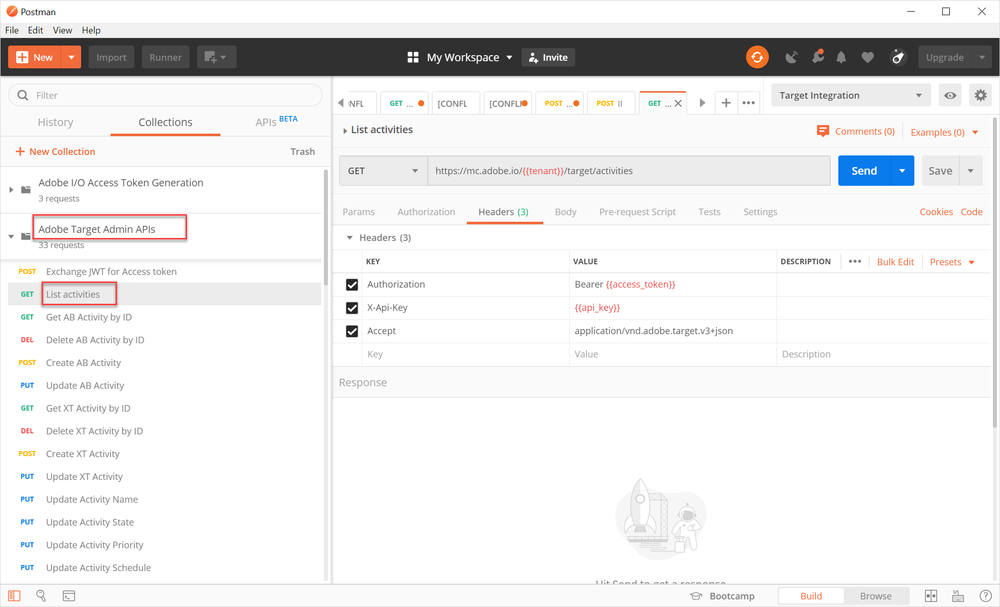

# 配置Adobe Target API的身份验证

Adobe Target管理员API，包括 [!DNL Recommendations] 管理员API通过身份验证进行保护，以确保只有授权用户才能使用它们访问Adobe Target。 使用 [Adobe Developer控制台](https://console.adobe.io/) 管理所有Adobe Experience Cloud解决方案的此身份验证，包括 [!DNL Target].

本课程将介绍生成身份验证令牌所需的初步步骤，这些令牌是成功与Adobe Target API交互所需的。 在以下部分中，您将：

1. 在Adobe Developer控制台中创建项目（以前称为集成）。
2. 将项目详细信息导出到Postman。
3. 生成载体访问令牌。
4. 测试载体访问令牌。

## 先决条件

| 资源 | 详细信息 |
| --- | --- |
| Postman | 要成功完成这些步骤，请获取 [Postman应用程序](https://www.postman.com/downloads/) 操作系统。 Postman Basic免费创建帐户。 虽然通常使用Adobe Target API并非必需，但Postman可简化API工作流程，而且Adobe Target提供了多个Postman集合来帮助执行其API并了解它们的操作方式。 本教程的其余部分假定您具有Postman的工作知识。 如需帮助，请参考 [Postman文档](https://learning.getpostman.com/). |
| 引用 | 在本教程的其余部分中，我们假定您熟悉以下资源：<UL><li>[Adobe I/OGithub](https://github.com/adobeio)</li><li>[TargetAdobe I/O文档](https://developers.adobetarget.com/api/#introduction)</li><li>[Recommendations API文档](https://developers.adobetarget.com/api/recommendations/)</li></ul> |

## 创建Adobe I/O项目

在此部分中，您将访问Adobe Developer控制台并为 [!DNL Adobe Target]. 有关更多信息，请参阅 [项目文档](https://www.adobe.io/apis/experienceplatform/console/docs.html#!AdobeDocs/adobeio-console/master/projects.md).

<!--1. Generate your private key and public certificate, per the [documentation on authentication](https://www.adobe.io/authentication/auth-methods.html#!AdobeDocs/adobeio-auth/master/JWT/JWTCertificate.md). //<!--as described in **Step 1** of [How to set up Adobe IO: Authentication - Step by Step](https://helpx.adobe.com/marketing-cloud-core/kb/adobe-io-authentication-step-by-step.html). After completing Step 1, return to this tutorial and resume with Step 2, below. // The outcome of this step should be the creation of a `private.key` file and a `certificate_pub.crt` file. Return to this tutorial once you have generated these two files.-->

1. 在 [Adobe Admin Console](https://adminconsole.adobe.com/)，请确保已同时为您的Adobe用户帐户 [产品管理员](https://helpx.adobe.com/enterprise/using/admin-roles.html) 和 [开发人员](https://helpx.adobe.com/enterprise/using/manage-developers.html) 级别访问权限 [!DNL Target].

2. 在 [Adobe Developer控制台](https://console.adobe.io/)，选择要为其创建此集成的Experience Cloud组织。 (请注意，您可能只能访问单个Experience Cloud组织。)

   

3. 单击 **[!UICONTROL 创建新项目]**.

   

4. 单击 **[!UICONTROL 添加API]** 向项目添加REST API以访问Adobe服务和产品。

   

5. 选择 **[!DNL Adobe Target]** 作为您希望与集成的Adobe服务。 单击 **[!UICONTROL 下一个]** 按钮。

   

6. 选择一个选项，以将公钥和私钥与您为Target创建的服务帐户集成关联。 在本教程中，选择 **[!UICONTROL 选项1:生成键对]** 单击 **[!UICONTROL 生成密钥对]**.
   

7. 注意结果！ 按照说明，记下自动下载的配置文件(`config`)，其中包含您的私钥。 单击&#x200B;**[!UICONTROL 下一步]**。
   
8. 在文件系统中，验证 `config`，上一步中创建的压缩配置文件。 再说一次，这 `config` 文件包含您的私钥，您以后需要该私钥。 文件系统中的确切位置可能与此处显示的位置不同。
   
9. 返回Adobe Developer控制台，选择 [产品配置文件](https://helpx.adobe.com/enterprise/using/manage-products-and-profiles.html) 对应于您正在使用的属性 [!DNL Recommendations]. （如果您没有使用属性，请选择默认工作区选项。） 单击 **[!UICONTROL 保存配置的API]**.
   

10. 单击 **[!UICONTROL 创建集成]**. 您应会收到一条临时消息，指示您的API已成功配置。

11. 最后，将项目重命名为比原始名称更有意义的名称 `Project 1`. 要实现此目的，请使用所示的导航路径导航到项目，单击 **[!UICONTROL 编辑项目]** 访问**[!UICONTROL 编辑项目] ，然后重命名项目。

>[!NOTE]
> 
>在本教程中，我们将项目命名为“Target集成”。 如果您预计项目不仅仅用于Adobe Target，您可能还需要相应地命名它。 例如，您可以选择将其命名为“AdobeAPI”或“Experience CloudAPI”，因为它可以与Adobe Experience Cloud中的其他解决方案一起使用。

## 导出项目详细信息

现在，您已拥有一个Adobe项目，可用于访问 [!DNL Target]，您需要确保发送该项目的详细信息以及AdobeAPI请求。 需要提供这些详细信息，才能与多个AdobeAPI进行交互，包括若干个 [!DNL Target] API。 例如，集成详细信息包括 [!DNL Target] 管理员API。 因此，要将API与Postman一起使用，您需要将这些详细信息导入Postman。

在Postman中可以通过多种方式指定项目的详细信息，但在此部分中，我们将利用一些预建功能和收藏集。 首先（在此部分中），您将将集成的详细信息导出到Postman环境。 接下来（在以下部分中），您将生成一个载体访问令牌，以授予您访问必要Adobe资源的权限。

>[!NOTE]
>
>有关适用于任何Experience Cloud解决方案(包括 [!DNL Target]，请参阅 [将Postman与Experience PlatformAPI结合使用](https://experienceleague.adobe.com/docs/platform-learn/tutorials/platform-api-authentication.html?lang=en). 以下部分与 [!DNL Target] API:
>
> 1. 将Adobe I/O集成详细信息导出到Postman
> 2. 使用Postman生成访问令牌

>
> 下面还提供了这些步骤。

1. 仍在 [Adobe Developer控制台](https://console.adobe.io/)，导航以查看新项目的 **[!UICONTROL 服务帐户(JWT)]** 凭据。 使用左侧导航或 **[!UICONTROL 凭据]** 的子菜单。
   
在 **[!UICONTROL 凭据详细信息]**&#x200B;请注意，您可以在 **公钥**, **客户端ID**，以及与您的服务帐户相关的其他信息。
   
2. 单击可导航到有关 **[!UICONTROL Adobe Target]** API。 使用左侧导航或 **[!UICONTROL 连接的产品和服务]** 的子菜单。
   
3. 单击 **[!UICONTROL 下载Postman版]** > **[!UICONTROL 服务帐户(JWT)]** 创建用于捕获Postman环境的身份验证信息的JSON文件。
   
记下文件系统中的JSON文件。
   
4. 在Postman中，单击齿轮图标以管理环境，然后单击 **导入** 导入JSON文件（环境）。
   
5. 选择文件并单击 **打开**.
   
6. 在Postman **管理环境** 模式窗口中，单击新导入环境的名称以对其进行检查。 (您的环境名称可能与此处显示的名称不同。 根据需要编辑名称。 它不一定需要匹配Adobe项目的名称。)
   
7. 注意 `CLIENT_SECRET` 和 `API_KEY` （以及其他变量）已预填充其值，这些值取自在Adobe Developer控制台中定义的集成。 (Postman `CLIENT_SECRET` 变量应与 `CLIENT SECRET` Adobe凭据（如开发人员控制台中显示），以及 `API_KEY` Postman也应该匹配 `CLIENT ID` )。 相反，请注意 `PRIVATE_KEY`, `JWT_TOKEN`和 `ACCESS_TOKEN` 为空。 让我们从提供 `PRIVATE_KEY` 值。
   

   >[!NOTE]
   >
   >**惊喜！**
   >
   >小测验！ 你记得私钥在哪吗？
   >没错，在 `config` 文件是先前从Adobe Developer控制台下载的！

8. 从文件系统中，打开 `config` 文件，然后打开 `private` 键文件。
   
9. 选择并复制 `private` 键文件。
   
10. 在Postman中，将您的私钥值粘贴到 **初始值** 和 **当前值** 字段。
   
11. 单击 **[!UICONTROL 更新]**，然后关闭“环境”模式窗口。

## 生成承载访问令牌

在此部分中，您将生成载体访问令牌，该令牌用于验证您与Adobe Target API的交互。 要生成载体访问令牌，您需要将集成详细信息（在前面各节中建立）发送到 [AdobeIdentity Management服务(IMS)](https://www.adobe.io/authentication/auth-methods.html#!AdobeDocs/adobeio-auth/master/AuthenticationOverview/AuthenticationGuide.md). 可以使用几种不同的方法来实现此目的，但在本教程中，我们让您为IMS API构建一个定制的POST请求。 开个玩笑。 在本教程中，我们将利用包含预建IMS调用的Postman集合，该集合可让流程直接且轻松。 导入收藏集后，您可以根据需要重复使用该收藏集，以便不仅为Adobe Target生成新令牌，还为其他AdobeAPI生成新令牌。

1. 导航到 [AdobeIdentity Management服务API调用示例](https://github.com/adobe/experience-platform-postman-samples/tree/master/apis/ims).
   
2. 单击 **Adobe I/O访问令牌生成Postman集合**.
   
3. 通过单击 **原始**，然后将生成的JSON复制到剪贴板。 （或者，您也可以将原始JSON另存为.json文件。）
   
4. 在Postman中，通过从剪贴板粘贴和提交原始JSON来导入集合。 （或者，您也可以上传您保存的.json文件。） 单击&#x200B;**继续**。
   
5. 选择 **[!UICONTROL IMS:JWT通过用户令牌生成+身份验证]** 请求(位于Adobe I/O访问令牌生成Postman集合中)，确保已选择您的环境，然后单击 **发送** 以生成令牌。

   

   >[!NOTE]
   >
   >此载体访问令牌将在24小时内有效。 当您需要生成新令牌时，请再次发送请求。

6. 再次打开管理环境模式，然后选择您的环境。
   
7. 请注意 `ACCESS_TOKEN` 和 `JWT_TOKEN` 值现已填充。
   

>[!NOTE]
>
>问：我是否必须使用Adobe I/O访问令牌生成Postman集合来生成JSON Web令牌(JWT)和载体访问令牌？
>
>答：不！ Adobe I/O访问令牌生成Postman集合可方便您在Postman中更轻松地生成JWT和载体访问令牌。 或者，您也可以使用Adobe Developer控制台中的功能手动生成载体访问令牌。

## 测试承载访问令牌

在本练习中，您将通过发送API请求来使用新的载体访问令牌，以从 [!DNL Target] 帐户。 成功响应表示您的Adobe项目和身份验证正在按预期运行，以便使用API。

1. 导入 [Adobe Target管理API Postman Collection](https://developers.adobetarget.com/api/#admin-postman-collection). 在集合导入Postman之前，请按照所有提示操作。
   
1. 展开收藏集，并记下 **[!UICONTROL 列出活动]** 请求。
   
1. 请注意， `{{access_token}}` 最初尚未解决。 您可以通过几种不同的方式解决此问题 — 例如，您可以定义一个名为 `{{access_token}}` — 但是在本教程中，您将更改API请求以利用您之前使用的Postman环境。 这将使环境能够继续充当跨AdobeAPI通用的所有变量的单一、一致的整合。
   
1. 要替换的类型 `{{access_token}}` with `{{ACCESS_TOKEN}}`.
   
1. 要替换的类型 `{{api_key}}` with `{{API_KEY}}`.
   
1. 要替换的类型 `{{tenant}}` with `{{TENANT_ID}}`. 注意 `{{TENANT_ID}}` 尚未识别。
   
1. 打开管理环境模式，然后选择您的环境。
   
1. 键入以添加新 `{{TENANT_ID}}` 环境变量。 将您的租户ID值复制并粘贴到 **初始值** 和 **当前值** 新的字段 `TENANT_ID` 环境变量。

   

   >[!NOTE]
   >
   >租户ID与您的 [!DNL Target] `clientcode`. 登录到后，URL中存在租户ID [!DNL Target]. 要获取您的租户ID，请登录到 [!DNL Adobe Experience Cloud]，打开 [!DNL Target]，然后单击 [!DNL Target] 卡。 按照URL子域中所述，使用租户ID值。
   >
   >例如，如果您登录Adobe Target时的URL是
   >
   >`<https://mycompany.experiencecloud.adobe.com/...>`
   >
   >则您的租户ID为“mycompany”。

1. 在确保选择了正确的环境后，发送您的请求。 您应会收到一个包含活动列表的响应。
   

恭喜！ 现在，您已验证Adobe身份验证，接下来可以使用它与Adobe Target API(以及其他AdobeAPI)进行交互。 例如，您可以 [使用Recommendations API](https://developer.adobe.com/target/before-administer/recs-api/){target=_blank}创建或管理推荐。
