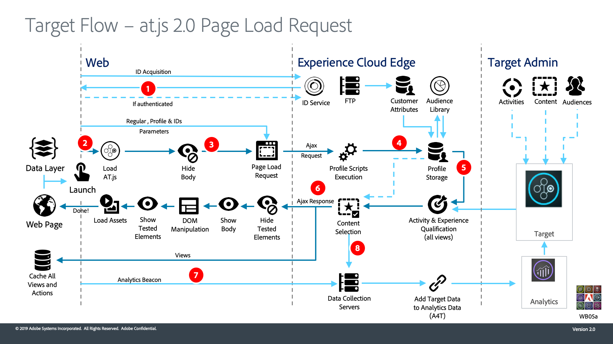

# 了解Adobe Target的at.js 2.0的工作原理

`at.js` 2.0增强了Adobe Target对单页应用程序(SPA)的支持并与其他Experience Cloud解决方案集成。 此视频和随附的图表说明了如何将所有内容组合在一起。

>[!VIDEO](https://video.tv.adobe.com/v/26250?quality=12)

## 架构图

1. 调用返回Experience Cloud ID (ECID)。 如果用户通过了身份验证，则另一调用会同步客户ID。

1. `at.js`库同步加载并隐藏文档正文（`at.js`也可以使用页面上实施的可选预隐藏代码片段异步加载）。

1. 将会发出页面加载请求，其中包括已配置的所有参数，如ECID、SDID和客户ID。

1. 配置文件脚本执行并进入[!UICONTROL 配置文件存储区]。 存储区向[!UICONTROL 受众库]请求符合条件的受众（例如从[!DNL Analytics]、Audience Manager等共享的受众）。 [!UICONTROL 客户属性]在批处理过程中发送到[!UICONTROL 配置文件存储区]。
1. 根据URL、请求参数和配置文件数据，[!DNL Target]可决定哪些活动和体验可返回给当前页面和未来视图的访客

1. 目标内容会发送回页面，其中可能包含其他个性化的配置文件值。

   当前页面上的目标内容会在默认内容不发生闪烁的情况下尽快显示。

   单页应用程序的未来视图的目标内容将缓存在浏览器中，因此当视图触发时，可以立即应用它而无需额外的服务器调用。 （有关`triggerView()`行为，请参阅下图）。

1. 从页面向[!UICONTROL 数据收集]服务器发送的[!DNL Analytics]数据
1. [!DNL Target]数据通过SDID匹配到Analytics数据，并且已处理到[!DNL Analytics]报表存储中。 然后，便可以在[!DNL Analytics]和[!DNL Target]中通过A4T报表查看[!DNL Analytics]数据。

使用triggerView()函数时的

1. 在单页应用程序中调用`adobe.target.triggerView()`
1. 从缓存中读取视图的目标内容

1. 目标内容会在默认内容不发生闪烁的情况下尽快显示

1. 通知请求将发送到[!DNL Target] [!UICONTROL 配置文件存储区]以计算活动中的访客和递增量度
1. [!DNL Analytics]数据从SPA发送到[!UICONTROL 数据收集]服务器

1. [!DNL Target]数据从[!DNL Target]后端发送到[!UICONTROL 数据收集]服务器。 [!DNL Target]数据通过SDID与[!DNL Analytics]数据匹配，并且已处理到[!DNL Analytics]报表存储中。 然后，便可以在[!DNL Analytics]和[!DNL Target]中通过A4T报表查看[!DNL Analytics]数据。

## 其他资源

* [在单页应用程序中实施at.js 2.0](implement-atjs-20-in-a-single-page-application.md)
* [使用Adobe Target的可视化体验编辑器处理单页应用程序(SPA VEC)](../experiences/use-the-visual-experience-composer-for-single-page-applications.md)
