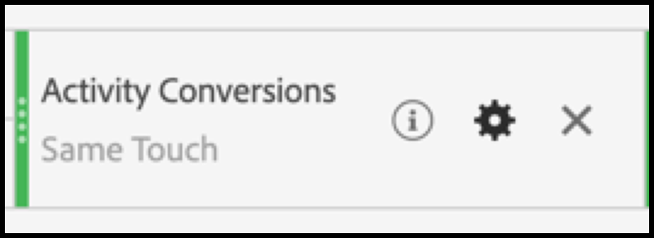

# 在Analysis Workspace中为[!DNL Auto-Target]活动设置A4T报告

[!DNL Auto-Target]活动的“目标分析(A4T)”集成使用Adobe Target的集成机器学习(ML)算法，根据每个访客的用户档案、行为和上下文为每个选择最佳体验，同时使用Adobe Analytics目标量度。

虽然Adobe Analytics Analysis Workspace中提供丰富的分析功能，但由于实验活动（手动A/B和自动分配）与个性化活动([!DNL Auto-Target])之间的差异，需要对默认的&#x200B;**[!UICONTROL Analytics for 目标]**&#x200B;面板进行一些修改才能正确解释[!DNL Auto-Target]活动。

本教程将介绍在Workspace中分析[!DNL Auto-Target]活动的建议修改，这些修改基于以下主要概念：

* **[!UICONTROL Control与Targeted]**&#x200B;维度可用于区分控制体验与[!DNL Auto-Target]集成ML算法提供的控制体验。
* 在查看体验级别的性能划分时，应将访问用作标准化量度。 此外，[Adobe Analytics的默认计数方法可能包括用户实际看不到活动内容](https://experienceleague.adobe.com/docs/target/using/integrate/a4t/a4t-faq/a4t-faq-viewing-reports.html?lang=en#metrics)的访问，但可通过使用适当范围的区段来修改此默认行为（详细信息如下）。
* Adobe Target的ML模型在其培训阶段使用访问 — 回顾范围的归因（在指定的归因模型上也称为“访问回顾窗口”），在划分目标量度时应使用相同的（非默认）归因模型。

## 在Workspace中为[!DNL Auto-Target]面板创建A4T

要为[!DNL Auto-Target]报表创建A4T，请使用Workspace中的&#x200B;**[!UICONTROL “目标分析”面板进行开始（如下所示），或以自由格式表开头。]**&#x200B;然后进行以下选择：

1. **[!UICONTROL 控制体验]**:您可以选择任何体验；但是，您以后将覆盖此选项。请注意，对于[!DNL Auto-Target]活动，控制体验实际上是一种控制策略，即a)在所有体验中随机提供，或b)提供单个体验(此选项是在Adobe Target的活动创建时做出的)。 即使您选择了选择(b) — 您的[!DNL Auto-Target]活动指定了特定体验作为控件 — 您仍应按照本教程中概述的方法分析[!DNL Auto-Target]活动的A4T。
2. **[!UICONTROL 标准化量度]**:选择访问。
3. **[!UICONTROL 成功量度]**:尽管您可以选择要报告的任何量度，但通常应将报告视图到在Adobe Target中创建活动时选择用于优化的同一量度。

*png图1:针对目标的分析面板设置 [!DNL Auto-Target] 活动。*

>[!NOTE]
>
>要为自动目标活动设置“目标”面板，请选择任何控制体验，选择“访问”作为标准化量度，然后选择在创建目标活动时为优化而选择的相同目标量度。

## 使用“控件”与“目标”尺寸将Adobe Target的集成ML模型与您的控件进行比较

默认的A4T面板专为经典（手动）A/B测试或自动分配活动而设计，其目标是将各个体验的性能与控制体验进行比较。 但是，在[!DNL Auto-Target]活动中，第一阶比较应在控制&#x200B;*策略*&#x200B;和目标&#x200B;*策略*&#x200B;之间（即，确定[!DNL Auto-Target]集成ML模型对控制策略的整体性能的提升）。

要执行此比较，请使用&#x200B;**[!UICONTROL 控制与目标(目标分析)]**&#x200B;维度。 拖放以替换默认A4T报表中的&#x200B;**[!UICONTROL 目标体验]**&#x200B;维度。

请注意，此替换将使A4T面板上的默认提升和置信度计算失效。 为避免混淆，您可以从默认面板中删除这些量度，同时保留以下报表：

*png图2:建议的活动基准 [!DNL Auto-Target] 报告。此报表已配置为将目标流量（由集成ML模型提供）与您的控制流量进行比较。*

>[!NOTE]
>
>目前，对于自动目标的A4T报表，“控制”和“目标”维度不提供提升和置信度数。 在添加支持之前，可以通过下载[置信度计算器](https://experienceleague.adobe.com/docs/target/assets/complete_confidence_calculator.xlsx?lang=en)手动计算提升度和置信度。

## 添加量度的体验级别划分

要进一步了解集成ML模型的运行情况，您可以检查&#x200B;**[!UICONTROL 控制与目标]**&#x200B;维度的体验级别划分。 在工作区中，将&#x200B;**[!UICONTROL 目标体验]**&#x200B;维度拖到报表上，然后分别划分控制维和目标维。

*png图3:按目标体验划分目标维度*

此处显示结果报表的示例。

*png图4:具有体 [!DNL Auto-Target] 验级别划分的标准报表。请注意，您的目标量度可能不同，您的控制策略可能具有单一体验。*

>[!TIP]
>
>在Workspace中，单击齿轮图标以隐藏“转化率”列中的“百分比”，以帮助保持对体验转化率的关注。 请注意，这些转化率随后将格式化为小数，但会相应地将其解释为百分比。

## 为什么“访问”是[!DNL Auto-Target]活动的正确标准化量度

分析[!DNL Auto-Target]活动时，始终选择“访问”作为默认标准化量度。 [!DNL Auto-Target] “个性化”为每次访问选择一次访客体验(正式，每次Adobe Target会话一次)，这意味着每次访问时向用户显示的体验都可以更改。因此，如果您使用“唯一访客”作为标准化量度，则单个用户最终可能会看到多个体验（跨不同访问），这会导致转化率混淆。

一个简单的示例演示了这一点：请考虑一种情况，其中两个访客输入只有两个体验的活动。 第一次访客访问两次。 他们在第一次访问时被分配到体验A，但在第二次访问时被分配到体验B(由于他们在第二次访问时的用户档案状态发生更改)。 第二次访问后，访客通过下订单进行转换。 转换归因于最近显示的体验（体验B）。 第二个访客也访问两次，并显示两次体验B，但从不转换。

让我们比较访客级和访问级报表：

| 体验 | 独特访客 | 访问次数 | 转化 | 访客规范。 康夫。 比率 | 访问规范。 康夫。 比率 |
| --- | --- | --- | --- | --- | --- |
| 同类群组 | 1 | 1 | - | 0% | 0% |
| B | 2 | 3 | 1 | 50% | 33.3% |
| 总计 | 2 | 4 | 1 | 50% | 25% |
*表1:示例比较访客标准化报表和访问标准化报表，其中决策对访问具有粘性(而非访客，与常规A/B测试一样)。访客标准化量度在此方案中容易混淆。*

如表所示，访客级数字明显不一致。 尽管有两种完全唯一的访客，但这并不是每种体验的单独唯一访客的总和。 虽然访客级转化率未必是错的，但如果比较个人体验，访问级转化率可以说更有意义。 从形式上讲，分析单位（“访问”）与决策粘性单位相同，这意味着可以添加和比较体验级别的指标划分。

## 筛选对活动的实际访问

Adobe Analytics对目标活动的访问的默认计数方法可能包括用户未与目标活动交互的访问。 这是由于目标活动分配在Analytics访客上下文中保持的方式。 结果，访问目标活动的次数有时会被夸大，导致转化率抑郁。

如果您希望报告用户实际与“自动目标”活动交互的访问(通过进入活动、显示/访问事件或转换)，您可以：

1. 创建包含所述目标活动点击量的特定区段，然后
1. 使用此区段筛选访问量度。

**要创建区段，请执行以下操作：**

1. 在Workspace工具栏中选择&#x200B;**[!UICONTROL 组件>创建区段]**&#x200B;选项。
2. 输入区段的&#x200B;**[!UICONTROL 标题]**。 在以下示例中，区段名为[!DNL "Hit with specific Auto-Target activity"]。
3. 将&#x200B;**[!UICONTROL 目标活动]**&#x200B;维度拖到段&#x200B;**[!UICONTROL 定义]**&#x200B;部分。
4. 使用&#x200B;**[!UICONTROL equals]**&#x200B;运算符。
5. 搜索您的特定目标活动。
6. 选择齿轮图标，然后选择&#x200B;**[!UICONTROL 归因模型>实例]**，如下图所示。
7. 单击&#x200B;**[!UICONTROL 保存]**。

*png图5:使用此处显示的区段等区段来筛选报表A4T中的“访问量”量 [!DNL Auto-Target] 度*

创建区段后，使用它过滤“访问”量度，因此“访问”量度仅包括用户与目标活动互动的访问。

**要使用此区段筛选访问，请执行以下操作：**

1. 从组件工具栏中拖动新创建的区段，并将指针悬停在&#x200B;**[!UICONTROL 访问]**&#x200B;量度标签的基上，直到出现蓝色&#x200B;**[!UICONTROL 按]**&#x200B;过滤提示。
2. 释放区段。 筛选器将应用于该量度。

最终面板将显示如下。

*png图6:报告面板，其中“点击特定的自动目标活动”区段应用于“访  客”量度。这确保只有用户实际与相关目标活动互动的访问才会包含在报表中。*

## 在ML模型训练和目标量度生成之间对齐归因

A4T集成允许使用Adobe Analytics用于生成性能报告&#x200B;*的相同转换事件数据对*&#x200B;的ML模型进行[!DNL Auto-Target]培训&#x200B;*。*&#x200B;但是，在培训ML模型时，必须使用某些假设来解释此数据，这与在Adobe Analytics的报告阶段所作的默认假设不同。

具体而言，Adobe Target的ML模型使用访问范围的归因模型。 也就是说，他们假定活动的内容显示必须在同一访问中进行转换，以便转换“归因”于ML模型所做的决策。 这要求目标保证及时培训其模式；目标最多等待30天进行转换(Adobe Analytics中报表的默认归因窗口)，然后才将其包含在模型的培训数据中。

因此，目标模型（在培训期间）使用的归因与查询数据（在生成报告期间）使用的默认归因之间的差异可能导致差异。 ML模型甚至似乎表现欠佳，而实际上问题与归因有关。

>[!TIP]
>
>如果ML模型针对与您在报表中查看的量度不同的量度进行优化，则这些模型可能不会按预期效果运行！ 为避免出现这种情况，请确保报表中的目标量度使用与目标的ML模型所使用的相同归因。

要视图与Adobe Target ML模型使用的相同归因方法的目标量度，请执行以下步骤：

1. 将鼠标悬停在目标量度的齿轮图标上：
   
1. 从显示的菜单，滚动到&#x200B;**[!UICONTROL 数据设置]**。
1. 选择&#x200B;**[!UICONTROL 使用非默认归因模型]**（如果尚未选择）：
   
1.  点击&#x200B;**[!UICONTROL 编辑]**。
1. 选择&#x200B;**[!UICONTROL Model]**:**[!UICONTROL 参与]**&#x200B;和&#x200B;**[!UICONTROL 回顾窗口]**:**[!UICONTROL 访问]**。
   
1. 单击&#x200B;**[!UICONTROL 应用]**。

这些步骤可确保您的报表将目标量度归因于体验的显示，前提是目标量度事件在显示体验的同一次访问中发生了&#x200B;*任何时间*（“参与”）。

## 最后一步：创建捕获上述神奇功能的转化率

在前几节中对访问量度和目标量度进行修改后，您对[!DNL Auto-Target]报告面板的默认A4T进行的最终修改是创建与适当过滤的“访问量”量度的正确比率（具有适当属性的目标量度的正确比率）的转化率。

通过使用以下步骤创建计算量度来执行此操作：

1. 在Workspace工具栏中选择&#x200B;**[!UICONTROL 组件>创建量度]**&#x200B;选项。
1. 为量度输入&#x200B;**[!UICONTROL 标题]**。 例如，“活动XXX的访问更正转化率”。
1. 选择&#x200B;**[!UICONTROL 格式]** =百分比，**[!UICONTROL 小数位]** = 2。
1. 将您活动的相关目标量度(例如，活动转换)拖入定义中，并使用此目标量度上的齿轮图标将归因模型调整为（参与|访问），如前所述。
1. 从&#x200B;**[!UICONTROL 定义]**&#x200B;部分的右上角选择&#x200B;**[!UICONTROL 添加>容器]**。
1. 在两个容器之间选择除法(Brazil)运算符。
1. 为此特定的[!DNL Auto-Target]活动，拖动您之前创建的区段(在本教程中名为“使用特定[!DNL Auto-Target]活动点击”)。
1. 将&#x200B;**[!UICONTROL 访问]**&#x200B;量度拖入区段容器。
1. 单击&#x200B;**[!UICONTROL 保存]**。

此处显示完整的计算量度定义。

*png图7:访问和归因修正模型转化率量度定义。(请注意，此量度取决于您的目标量度和活动。 换句话说，此量度定义不可跨活动重用。)*

>[!IMPORTANT]
>
>A4T面板中的转化率量度未链接到表中的转换事件或标准化量度。 当您进行本教程中建议的修改时，转化率不会自动适应更改。 因此，如果您修改了一个（或两个）转换事件属性和标准化量度，则您必须记住，最后一步还要修改转化率，如上所示。

## 摘要：[!DNL Auto-Target]报告的最终工作区面板示例

将上述所有步骤组合到单个面板中，下图显示了[!DNL Auto-Target] A4T活动的建议报告的完整视图。 此报表与目标的机器学习模型用于优化目标量度的报表相同，并包含本教程中讨论的所有细微差别和建议。 此报告也与传统目标报告驱动[!DNL Auto-Target]活动中使用的计数方法最接近。

*png图8:Adobe Analytics Workspace中的最 [!DNL Auto-Target] 终A4T报表，它将对此文档前几节所述量度定义的所有调整组合在一起。*
