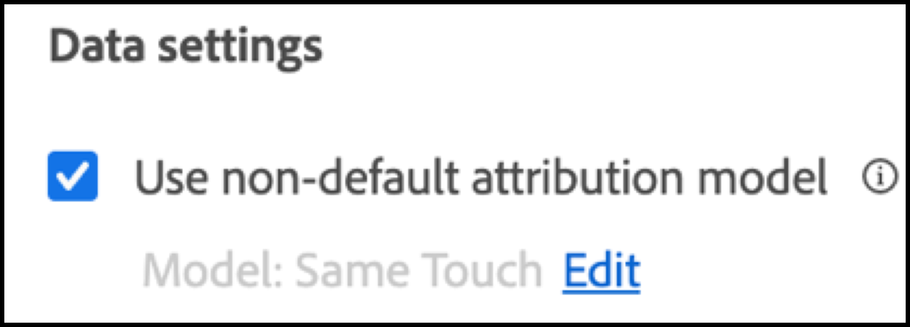

# 在[!DNL Analysis Workspace]中为[!DNL Auto-Target]活动设置A4T报表

>[!IMPORTANT]
>
>对于[!UICONTROL Auto-Target]活动，您必须检查[!DNL Analytics Workspace]中的报告并手动创建A4T面板。

[!DNL Auto-Target]活动的[!UICONTROL Analytics for Target] (A4T)集成使用[!DNL Adobe Target]集成机器学习(ML)算法，根据每位访客的个人资料、行为和上下文选择最佳体验，同时使用[!DNL Adobe Analytics]目标量度。

尽管[!DNL Adobe Analytics] [!DNL Analysis Workspace]中提供了丰富的分析功能，但由于实验活动（手动[!UICONTROL A/B Test]和[!UICONTROL Auto-Allocate]）和个性化活动([!UICONTROL [!UICONTROL Auto-Target]])之间存在差异，因此需要对默认&#x200B;**[!UICONTROL Analytics for Target]**&#x200B;面板进行一些修改才能正确解释[!DNL Auto-Target]活动。

本教程介绍了为分析[!DNL Analysis Workspace]中的[!UICONTROL Auto-Target]活动而建议的修改，这些修改基于以下关键概念：

* **[!UICONTROL Control vs Targeted]**&#x200B;维度可用于区分[!UICONTROL Control]体验与[!UICONTROL Auto-Target]组合ML算法提供的体验。
* 在查看体验级别的性能划分时，应将访问用作标准化量度。 此外，[Adobe Analytics的默认计数方法可能包括用户实际看不到活动内容的访问](https://experienceleague.adobe.com/docs/target/using/integrate/a4t/a4t-faq/a4t-faq-viewing-reports.html#metrics){target=_blank}，但此默认行为可以通过使用适当限定范围的区段进行修改（详细信息见下文）。
* [!DNL Adobe Target] ML模型在其训练阶段使用访问回顾范围归因（在规定的归因模型上称为“访问回顾窗口”），并且在划分目标量度时应使用相同的（非默认）归因模型。

## 在[!DNL Analysis Workspace]中为[!UICONTROL Auto-Target]面板创建A4T

要为[!UICONTROL Auto-Target]报表创建A4T，请在[!DNL Analysis Workspace]中从&#x200B;**[!UICONTROL Analytics for Target]**&#x200B;面板开始（如下所示），或以自由格式表开始。 然后，进行以下选择：

1. **[!UICONTROL Control Experience]**：您可以选择任何体验；但是，您稍后将覆盖此选择。 请注意，对于[!UICONTROL Auto-Target]活动，控制体验实际上是一种控制策略，它适用于a)在所有体验中随机提供，或b)提供单个体验（此选择在[!DNL Adobe Target]中的活动创建时作出）。 即使您选择了选项(b)，您的[!UICONTROL Auto-Target]活动也会指定特定体验作为控制。 您仍然应该按照本教程中概述的方法分析[!UICONTROL Auto-Target]活动的A4T。
2. **[!UICONTROL Normalizing Metric]**：选择[!UICONTROL Visits]。
3. **[!UICONTROL Success Metrics]**：虽然您可以选择要报告的任何指标，但通常应查看与在[!DNL Target]中创建活动期间选择优化的同一指标有关的报告。

   [!UICONTROL Auto-Target]活动的![[!UICONTROL Analytics for Target]面板设置。](assets/Figure1.png)

   *图1：[!UICONTROL Auto-Target]活动的[!UICONTROL Analytics for Target]面板设置。*

>[!TIP]
>
>要为[!UICONTROL Auto-Target]活动设置[!UICONTROL Analytics for Target]面板，请选择任何控制体验，选择[!UICONTROL Visits]作为标准化量度，并选择在创建[!DNL Target]活动期间为优化选择的相同目标量度。

## 使用[!UICONTROL Control vs.Targeted]维度将[!DNL Target]组合ML模型与您的控件进行比较

默认A4T面板专为经典（手动） [!UICONTROL A/B Test]或[!UICONTROL Auto-Allocate]活动设计，其目标是比较各个体验与控制体验的性能。 但是，在[!UICONTROL Auto-Target]活动中，控制&#x200B;*策略*&#x200B;和目标&#x200B;*策略*&#x200B;之间的第一顺序比较应该是。 换句话说，确定[!UICONTROL Auto-Target]组合ML模型相对于控制策略的整体性能的提升。

要执行此比较，请使用&#x200B;**[!UICONTROL Control vs Targeted (Analytics for Target)]**&#x200B;维度。 拖放以替换默认A4T报表中的&#x200B;**[!UICONTROL Target Experiences]**&#x200B;维度。

请注意，此替换将使A4T面板上的默认[!UICONTROL Lift and Confidence]计算失效。 为避免混淆，您可以从默认面板中删除这些量度，并保留以下报表：

[!DNL Analysis Workspace]](assets/Figure2.png)中的![[!UICONTROL Experiences by Activity Conversions]面板

*图2：[!DNL Auto-Target]活动的建议基线报告。 此报表已配置为将目标流量（由组合ML模型提供）与您的控制流量进行比较。*

>[!NOTE]
>
>当前，[!UICONTROL Auto-Target]的A4T报表的[!UICONTROL Control vs Targeted]维度的[!UICONTROL Lift and Confidence]数字不可用。 在添加支持之前，可通过下载[置信度计算器](https://experienceleague.adobe.com/docs/target/assets/complete_confidence_calculator.xlsx)来手动计算[!UICONTROL Lift and Confidence]。

## 添加量度的体验级别细分

要进一步了解集成ML模型的执行情况，可以检查&#x200B;**[!UICONTROL Control vs Targeted]**&#x200B;维度的体验级别细分。 在[!DNL Analysis Workspace]中，将&#x200B;**[!UICONTROL Target Experiences]**&#x200B;维度拖动到报表中，然后分别划分每个控件维度和目标维度。

[!DNL Analysis Workspace]](assets/Figure3.png)中的![[!UICONTROL Experiences by Activity Conversions]面板

*图3：按Target体验划分目标维度*

此处显示了生成报表的示例。

[!DNL Analysis Workspace]](assets/Figure4.png)中的![[!UICONTROL Experiences by Activity Conversions]面板

*图4：包含体验级别划分的标准[!UICONTROL Auto-Target]报表。 请注意，您的目标量度可能不同，并且您的控制策略可能只有一个体验。*

>[!TIP]
>
>在[!DNL Analysis Workspace]中，单击齿轮图标可隐藏[!UICONTROL Conversion Rate]列中的百分比，以帮助将焦点集中在体验转化率上。 转换率随后将格式化为小数，但会相应地将其解释为百分比。

## 为什么“[!UICONTROL Visits]”是[!UICONTROL Auto-Target]活动的正确标准化量度

分析[!UICONTROL Auto-Target]活动时，始终选择[!UICONTROL Visits]作为默认的标准化量度。 [!UICONTROL Auto-Target]个性化为访客选择一次体验（正式地说，每次访问[!DNL Target]会话选择一次），这意味着向访客显示的体验在每次访问时都可能发生更改。 因此，如果您使用[!UICONTROL Unique Visitors]作为标准化量度，单个用户最终可能会看到多个体验（跨不同访问）这一事实将导致转化率混乱。

一个简单的示例演示了这一点：考虑一个场景，其中两个访客进入的营销活动只有两个体验。 第一个访客访问了两次。 访客在第一次访问时被分配给体验A，但在第二次访问时被分配给体验B（由于其配置文件状态在第二次访问时发生变化）。 在第二次访问后，访客通过下订单进行转化。 转化归因于最近显示的体验（体验B）。 第二个访客还会访问两次，并且两次都向访客显示体验B，但不会转化。

让我们比较访客级别报表和访问级别报表：

| 体验 | 独特访客 | 访问次数 | 转化 | 访客规范化的转化率 | 访问标准化转化率 |
| --- | --- | --- | --- | --- | --- |
| A | 1 | 1 | - | 0% | 0% |
| B | 2 | 3 | 1 | 50% | 33.3% |
| 总计 | 2 | 4 | 1 | 50% | 25% |

*表1：比较访客标准化和访问标准化报表的示例，其中比较决策对访问有粘性的情况（不是访客，如同常规A/B测试一样）。 在此场景中，访客规范化的量度令人困惑。*

如表所示，访客级别的数字存在明显的不一致性。 尽管存在两个总独特访客，但这不是每个体验的单个独特访客的总和。 尽管访客级别的转化率不一定错误，但在比较各个体验时，访问级别的转化率可能更有意义。 在形式上，分析单位（“访问量”）与决策绑定的单位相同，这意味着可以添加和比较体验级别的量度细分。

## 筛选活动的实际访问次数

[!DNL Target]活动访问的[!DNL Adobe Analytics]默认计数方法可能包括用户未与[!DNL Target]活动交互的访问。 这是由于在[!DNL Analytics]访客上下文中保留[!DNL Target]活动分配的方式。 因此，访问[!DNL Target]活动的次数有时可能会虚增，从而导致转化率降低。

如果您希望报告用户实际与[!UICONTROL Auto-Target]活动进行交互的访问（通过进入活动、显示或访问事件，或转化），您可以：

1. 创建一个特定区段，使其包含来自所讨论[!DNL Target]活动的点击，然后
1. 使用此区段筛选[!UICONTROL Visits]量度。

**创建区段：**

1. 在[!DNL Analysis Workspace]工具栏中选择&#x200B;**[!UICONTROL Components > Create Segment]**&#x200B;选项。
2. 为您的区段指定&#x200B;**[!UICONTROL Title]**。 在下面显示的示例中，该区段名为[!DNL "Hit with specific Auto-Target activity"]。
3. 将&#x200B;**[!UICONTROL Target Activities]**&#x200B;维度拖动到区段&#x200B;**[!UICONTROL Definition]**&#x200B;部分。
4. 使用&#x200B;**[!UICONTROL equals]**&#x200B;运算符。
5. 搜索您的特定[!DNL Target]活动。
6. 单击齿轮图标，然后选择&#x200B;**[!UICONTROL Attribution model > Instance]**，如下图所示。
7. 单击 **[!UICONTROL Save]**。

[!DNL Analysis Workspace]](assets/Figure5.png)中的![区段

*图5：使用如下图所示的区段过滤A4T中[!UICONTROL Auto-Target]报告*&#x200B;的[!UICONTROL Visits]量度

创建区段后，可使用该区段过滤[!UICONTROL Visits]量度，以便[!UICONTROL Visits]量度仅包含用户与[!DNL Target]活动交互的访问。

**使用此区段筛选[!UICONTROL Visits]：**

1. 从组件工具栏中拖动新创建的区段，并将鼠标悬停在&#x200B;**[!UICONTROL Visits]**&#x200B;量度标签的基数上，直到显示蓝色的&#x200B;**[!UICONTROL Filter by]**&#x200B;提示符。
2. 发布区段。 过滤器将应用于该量度。

最终面板如下所示：

[!DNL Analysis Workspace]](assets/Figure6.png)中的![[!UICONTROL Experiences by Activity Conversions]面板

*图6：报告面板，其中的“具有特定自动定位活动的点击”区段应用于[!UICONTROL Visits]指标。 此区段确保报告中仅包含用户实际与相关[!DNL Target]活动交互的访问。*

## 确保目标量度和归因与优化标准保持一致

A4T集成允许[!UICONTROL Auto-Target] ML模型使用[!DNL Adobe Analytics]用于&#x200B;*生成性能报表*&#x200B;的相同转化事件数据进行&#x200B;*培训*。 但是，在训练ML模型时，必须使用某些假设来解释此数据，这些假设与[!DNL Adobe Analytics]中报告阶段所做的默认假设不同。

具体而言，[!DNL Adobe Target] ML模型使用访问范围的归因模型。 也就是说，ML模型假设转化必须与活动内容的显示发生在同一访问中，这样转化才会“归因”到ML模型所做的决策。 这是[!DNL Target]保证及时训练其模型所必需的；[!DNL Target]不能等待最多30天的时间进行转换（[!DNL Adobe Analytics]中报表的默认归因窗口），然后才能将其包含在其模型的训练数据中。

因此，[!DNL Target]模型使用的归因（在培训期间）与查询数据时使用的默认归因（在生成报告期间）之间的差异可能会导致差异。 甚至可能显示ML模型表现不佳，而实际上问题出在归因上。

>[!TIP]
>
>如果ML模型正在针对某个量度进行优化，而该量度的归因不同于您在报表中查看的量度，则模型可能无法按预期发挥作用。 为避免出现这种情况，请确保报表上的目标量度使用[!DNL Target] ML模型使用的量度定义和归因相同。

确切的量度定义和归因设置取决于您在活动创建期间指定的[优化条件](https://experienceleague.adobe.com/docs/target/using/integrate/a4t/a4t-at-aa.html#supported){target=_blank}。

### Target定义的转化，或[!DNL Analytics]个包含&#x200B;*最大化的每次访问量度值*&#x200B;的量度

如果量度是[!DNL Target]转化，或者是[!DNL Analytics]具有&#x200B;**每次访问量度值最大化**&#x200B;的量度，则目标量度定义允许在同一次访问中发生多个转化事件。

要查看具有[!DNL Target] ML模型使用的相同归因方法的目标量度，请执行以下步骤：

1. 将鼠标悬停在目标量度的齿轮图标上：

   

1. 从生成的菜单中，滚动到&#x200B;**[!UICONTROL Data settings]**。
1. 选择&#x200B;**[!UICONTROL Use non-default  attribution model]**（如果尚未选择）。

   

1. 单击 **[!UICONTROL Edit]**。
1. 选择&#x200B;**[!UICONTROL Model]**： **[!UICONTROL Participation]**，**[!UICONTROL Lookback window]**： **[!UICONTROL Visit]**。

   

1. 单击 **[!UICONTROL Apply]**。

如果目标量度事件发生在显示体验的同一访问中的&#x200B;*任何时间* （“参与率”），这些步骤可确保报表将目标量度归因于体验的显示。

### 具有&#x200B;*独特访问转化率*&#x200B;的[!DNL Analytics]量度

**定义具有正量度区段的访问**

在您选择&#x200B;*最大化唯一访问转化率*&#x200B;作为优化标准的情况下，转化率的正确定义是指标值为正的访问次数的部分。 可通过以下方法来实现这一点：创建区段过滤以找出指标为正值的访问次数，然后过滤访问次数量度。

1. 与以前一样，在[!DNL Analysis Workspace]工具栏中选择&#x200B;**[!UICONTROL Components > Create Segment]**&#x200B;选项。
2. 为您的区段指定&#x200B;**[!UICONTROL Title]**。

   在下面显示的示例中，该区段名为[!DNL "Visits with an order"]。

3. 将您在优化目标中使用的基本指标拖动到区段中。

   在下面显示的示例中，我们使用&#x200B;**订单**&#x200B;量度，以便转化率测量记录订单的访问比例。

4. 在区段定义容器的左上方，选择&#x200B;**[!UICONTROL Include]** **访问**。
5. 使用&#x200B;**[!UICONTROL is greater than]**&#x200B;运算符，并将值设置为0。

   将该值设置为0意味着此区段包含订单量度为正值的访问。

6. 单击 **[!UICONTROL Save]**。

*图7：区段定义过滤正序访问。 根据活动的优化量度，您必须将订单替换为相应的量度*

**将此项应用于活动过滤量度中的访问**

此区段现在可用于过滤订单数为正数的访问，以及[!DNL Auto-Target]活动有点击的访问。 过滤量度的过程与之前类似，如果将新区段应用于已过滤的访问量度，则报表面板的外观应类似于图8

*图8：具有正确的唯一访问转化量度的报表面板：记录来自活动的点击并且转化量度（本示例中的订单）非零的访问次数。*

## 最后步骤：创建可捕捉上述神奇的转化率

通过前几节中对[!UICONTROL Visit]和目标量度所做的修改，您应该对[!DNL Auto-Target]报表面板的默认A4T进行的最终修改是，创建与经过适当过滤的“访问次数”量度正确比例的转化率。

为此，请使用以下步骤创建[!UICONTROL Calculated Metric]：

1. 在[!DNL Analysis Workspace]工具栏中选择&#x200B;**[!UICONTROL Components > Create Metric]**&#x200B;选项。
1. 为您的量度指定&#x200B;**[!UICONTROL Title]**。 例如，“活动XXX的访问校正转化率”。
1. 选择&#x200B;**[!UICONTROL Format]** =百分比和&#x200B;**[!UICONTROL Decimal Places]** = 2。
1. 将活动的相关目标量度（例如[!UICONTROL Activity Conversions]）拖动到定义中，然后使用此目标量度上的齿轮图标将归因模型调整为（参与率|访问），如前所述。
1. 从&#x200B;**[!UICONTROL Definition]**&#x200B;部分的右上角选择&#x200B;**[!UICONTROL Add > Container]**。
1. 选择两个容器之间的除(÷)运算符。
1. 在本教程中，将您之前创建的名为“具有特定[!UICONTROL Auto-Target]活动的点击”的区段拖放到该特定[!DNL Auto-Target]活动中。
1. 将&#x200B;**[!UICONTROL Visits]**&#x200B;指标拖动到区段容器中。
1. 单击 **[!UICONTROL Save]**。

>[!TIP]
>
> 您还可以使用[快速计算指标功能](https://experienceleague.adobe.com/docs/analytics-learn/tutorials/components/calculated-metrics/quick-calculated-metrics-in-analysis-workspace.html)创建此指标。

此处显示了完整的计算量度定义。

*图7：经访问校正和归因校正的模型转化率量度定义。 (请注意，此指标取决于您的目标指标和活动。 换句话说，此量度定义无法跨活动重复使用。)*

>[!IMPORTANT]
>
>A4T面板中的[!UICONTROL Conversion]比率量度未链接到表中的转化事件或标准化量度。 进行本教程中建议的修改时，[!UICONTROL Conversion]费率不会自动适应这些更改。 因此，如果您修改转化事件归因或标准化量度（或同时修改两者），则必须记住的最后一步也是修改[!UICONTROL Conversion]比率，如上所示。

## 摘要： [!UICONTROL Auto-Target]报告的最终示例[!DNL Analysis Workspace]面板

将以上所有步骤合并到一个面板中，下图显示了为[!UICONTROL Auto-Target]个A4T活动推荐的报告的完整视图。 此报表与[!DNL Target] ML模型用于优化目标量度的报表相同。 该报告包含本教程中讨论的所有细微差别和建议。 此报表也最接近传统[!DNL Target]报表驱动的[!UICONTROL Auto-Target]活动中使用的计数方法。

单击以展开图像。

在Analysis Workspace的[!DNL Analysis Workspace]](assets/Figure10.png "A4T报表中![最终A4T报表"){width="600" zoomable="yes"}

*图10： [!DNL Adobe Analytics] [!DNL Workspace]中的最终A4T [!UICONTROL Auto-Target]报告，它合并了本教程前面部分中描述的对量度定义的所有调整。*
