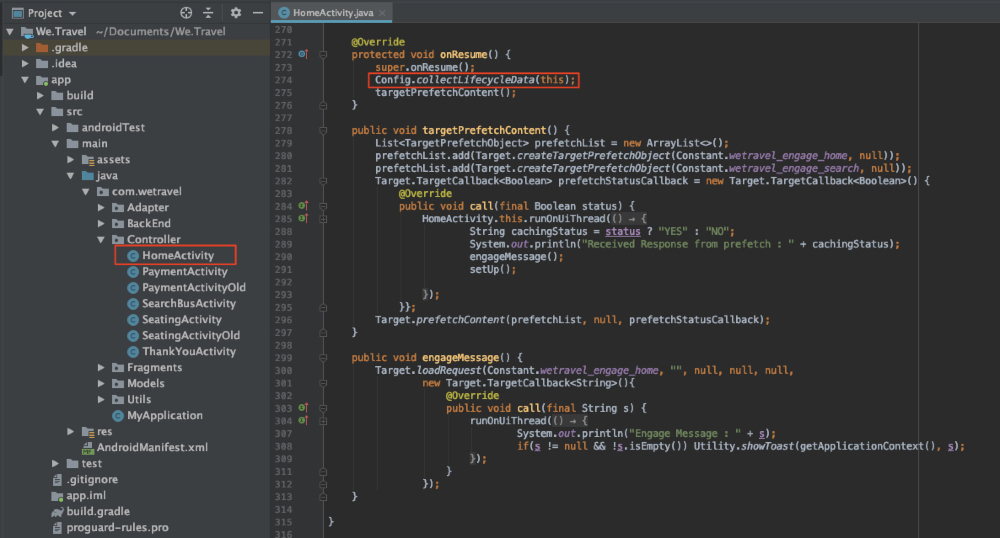

# 向请求中添加参数

在本课中，我们将在上一课添加的请求中添加Adobe [!DNL Target] 生命周期指标和自定义参数。 这些指标和参数将在教程的稍后部分用于创建个性化受众。

## 学习目标

在本课程结束时，您将能够：

* 添加Adobe移动生命周期指标
* 向预回迁请求添加参数
* 将参数添加到实时位置
* 验证两个请求的参数

## 添加生命周期参数

让我们启用Adobe移 [动生命周期指标](https://docs.adobe.com/content/help/en/mobile-services/android/metrics.html)。 这将向位置请求添加参数，这些请求包含有关用户设备和应用程序参与情况的丰富信息。 我们将在下一课中使用生命周期请求提供的数据构建受众。

要启用生命周期指标，请再次打开HomeActivity控制器， `Config.collectLifecycleData(this);` 并添加到onResume()函数：



### 验证预回迁请求的生命周期参数

运行模拟器并使用Logcat验证生命周期参数。 筛选“预取”以查找预取响应并查找新参数：


尽管我们只添加 `Config.collectLifecycleData()` 到HomeActivity控制器，您也应在ThankYou屏幕上看到随目标请求发送的生命周期指标。

## 将at_property参数添加到预回迁请求

Adobe Target属性在界面中 [!DNL Target] 定义，用于为个性化应用程序和网站建立界限。 at_property参数标识访问和维护优惠和活动的特定属性。 我们将向预回迁和实时位置请求添加属性。

>[!NOTE]
>
>根据许可证的不同，您可能会在界面中看 [!DNL Target] 到“属性”选项。 如果您没有这些选项，或者您没有在公司中使用属性，只需跳到本课的下一节。

您可以在“设置”>“属性”下的界 [!DNL Target] 面中检 [!UICONTROL 索at] _property [!UICONTROL 值]。  将鼠标悬停在属性上，选择代码片段图标并复制 `at_property` 值：


将其添加为预回迁请求中每个位置的参数，如下所示：
数此处是函数的更新 `targetPrefetchContent()` 代码(请务必更新 _[!UICONTROL at_property值，此处放置占位符文本]_!):

```java
public void targetPrefetchContent() {
        List<TargetPrefetchObject> prefetchList = new ArrayList<>();

        Map<String, Object> params1;
        params1 = new HashMap<String, Object>();
        params1.put("at_property", "your at_property value goes here");

        prefetchList.add(Target.createTargetPrefetchObject(Constant.wetravel_engage_home, params1));
        prefetchList.add(Target.createTargetPrefetchObject(Constant.wetravel_engage_search, params1));
        Target.TargetCallback<Boolean> prefetchStatusCallback = new Target.TargetCallback<Boolean>() {
            @Override
            public void call(final Boolean status) {
                HomeActivity.this.runOnUiThread(new Runnable() {
                    @Override
                    public void run() {
                        String cachingStatus = status ? "YES" : "NO";
                        System.out.println("Received Response from prefetch : " + cachingStatus);
                        engageMessage();
                        setUp();

                    }
                });
            }};
        Target.prefetchContent(prefetchList, null, prefetchStatusCallback);
    }
```

### 关于参数的注释

对于将来的项目，您可能希望实施其他参数。 该方 `createTargetPrefetchObject()` 法允许三种类型的参数： `locationParams`、 `orderParams`和 `productParams`。 有关将这些参 [数添加到预回迁请求的更多详细信息，请参阅文档](https://docs.adobe.com/content/help/en/mobile-services/android/target-android/c-mob-target-prefetch-android.html)。

另请注意，可以将不同的位置参数添加到预回迁请求中的每个位置。 例如，您可以创建另一个名为param2的映射，在其中放入一个新参数，然后在一个位置设置param2，在另一个位置设置param1。 以下是一个示例：

```java
prefetchList.add(Target.createTargetPrefetchObject(location1_name, params1);
prefetchList.add(Target.createTargetPrefetchObject(location2_name, params2);
```

## 验证预回迁请求中的at_property参数

现在运行模拟器并使用Logcat验证at_property是否在预取请求和两个位置的响应中显示：


## 将自定义参数添加到实时位置请求

在上一课中添加了实时位置请求(wetravel_context_dest)，因此我们可以在预订过程的最终确认屏幕上显示相关促销。 我们希望根据用户的目标个性化促销，并为此将其作为参数添加到请求中。 我们还将为trop来源和at_property值添加一个参数。

将以下参数添加到ThankYouActivity控制器中的targetLoadRequest()函数：
Location Request此处是targetLoadRequest()函数的更新代码（请务必更新“在此处添加at_property值”占位符文本！）:

```java
public void targetLoadRequest(final ArrayList<Recommandation> recommandations) {
    Map<String, Object> locationParams = new HashMap<>();
    locationParams.put("at_property","add your at_property value here");
    locationParams.put("locationSrc", (""+Utility.getInSharedPreference(ThankYouActivity.this,Constant.departure,"")));
    locationParams.put("locationDest", (""+Utility.getInSharedPreference(ThankYouActivity.this,Constant.destination,"")));

    Target.loadRequest(Constant.wetravel_context_dest, "", null, null, locationParams, new Target.TargetCallback<String>() {
        @Override
        public void call(final String response) {
        try {
            runOnUiThread(new Runnable() {
                @Override
                public void run() {
                    AppDialogs.dialogLoaderHide();
                    filterRecommendationBasedOnOffer(recommandations, response);
                    recommandationbAdapter.notifyDataSetChanged();
                }
            });
        } catch (Exception e) {
            e.printStackTrace();
        }
        }
    });
    Target.clearPrefetchCache();
}
```

### 验证实时位置请求中的自定义参数

运行模拟器并打开日志。 筛选某个参数以验证请求是否包含所需的参数：


>[!NOTE]
>
>订单确认请求和参数： 虽然此演示项目中未使用，但订单详细信息通常在实际实施中捕获，因 [!DNL Target] 此可以将订单详细信息用作度量／维。 有关如何实施订单确认请 [求和参数的说明](https://docs.adobe.com/content/help/en/mobile-services/android/target-android/c-target-methods.html)。

>[!NOTE]
>
>Analytics目标(A4T): AdobeAnalytics可以配置为报告源 [!DNL Target]。 这允许在AdobeAnalytics查看由目标SDK收集的所有指标／维度。 有关更 [多详细信息](https://docs.adobe.com/content/help/en/target/using/integrate/a4t/a4t.html) ，请参阅A4T概述。

干得好！ 现在参数就位了，我们可以使用这些参数创建Adobe Target受众和优惠。

**[下一个： “创建受众和优惠”>](create-audiences-and-offers.md)**
