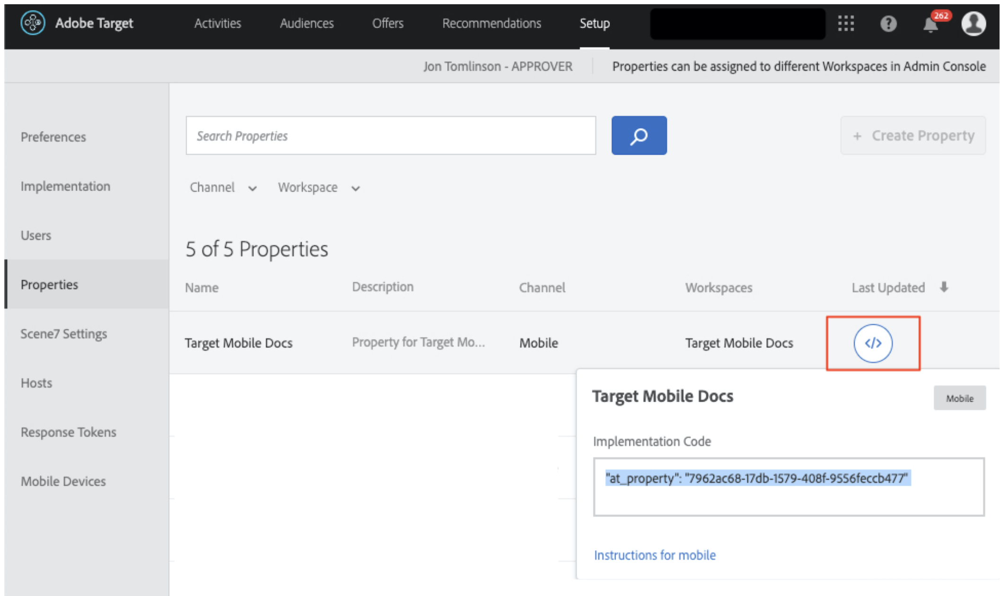

# 向请求添加参数

在本课程中，我们将将Adobe生命周期量度和自定义参数添加到上一课程中添加的[!DNL Target]请求。 在本教程的后面部分，这些量度和参数将用于创建个性化受众。

## 学习目标

在本课程结束时，您将能够：

* 添加Adobe移动生命周期量度
* 向预回迁请求添加参数
* 向实时位置添加参数
* 验证两个请求的参数

## 添加生命周期参数

让我们启用[Adobe移动生命周期量度](https://experienceleague.adobe.com/docs/mobile-services/android/metrics.html?lang=zh-Hans)。 这会将参数添加到位置请求，这些请求包含有关用户设备和应用程序参与情况的丰富信息。 我们将在下一课程中使用生命周期请求提供的数据来构建受众。

要启用生命周期量度，请再次打开HomeActivity控制器并将`Config.collectLifecycleData(this);`添加到onResume()函数：


### 验证预取请求的生命周期参数

运行模拟器并使用Logcat验证生命周期参数。 筛选“prefetch”以查找预取响应并查找新参数：


即使我们仅将`Config.collectLifecycleData()`添加到HomeActivity控制器，您也应该在ThankYou屏幕上看到随Target请求发送的生命周期量度。

## 将at_property参数添加到预取请求

Adobe Target属性在[!DNL Target]界面中定义，用于建立个性化应用程序和网站的边界。 at_property参数标识特定属性，可在其中访问和维护优惠和活动。 我们将向预取和实时位置请求添加一个资产。

>[!NOTE]
>
>根据您的许可，您在[!DNL Target]界面中可能会看到，也可能不会看到“属性”选项。 如果您没有这些选项，或者如果您未在公司中使用资产，则只需跳至本课程的下一部分。

您可以在[!UICONTROL Setup] > [!UICONTROL Properties]下的[!DNL Target]界面中检索您的at_property值。  将鼠标悬停在属性上，选择代码片段图标并复制`at_property`值：



将其添加为预回迁请求中每个位置的参数，如下所示：

以下是`targetPrefetchContent()`函数的更新代码（请确保更新&#x200B;_[!UICONTROL your at_property value goes here]_&#x200B;占位符文本！）：

```java
public void targetPrefetchContent() {
        List<TargetPrefetchObject> prefetchList = new ArrayList<>();

        Map<String, Object> params1;
        params1 = new HashMap<String, Object>();
        params1.put("at_property", "your at_property value goes here");

        prefetchList.add(Target.createTargetPrefetchObject(Constant.wetravel_engage_home, params1));
        prefetchList.add(Target.createTargetPrefetchObject(Constant.wetravel_engage_search, params1));
        Target.TargetCallback<Boolean> prefetchStatusCallback = new Target.TargetCallback<Boolean>() {
            @Override
            public void call(final Boolean status) {
                HomeActivity.this.runOnUiThread(new Runnable() {
                    @Override
                    public void run() {
                        String cachingStatus = status ? "YES" : "NO";
                        System.out.println("Received Response from prefetch : " + cachingStatus);
                        engageMessage();
                        setUp();

                    }
                });
            }};
        Target.prefetchContent(prefetchList, null, prefetchStatusCallback);
    }
```

### 关于参数的说明

对于未来的项目，您可能需要实施其他参数。 `createTargetPrefetchObject()`方法允许三种类型的参数： `locationParams`、`orderParams`和`productParams`。 有关将这些参数添加到预获取请求[&#128279;](https://experienceleague.adobe.com/docs/mobile-services/android/target-android/c-mob-target-prefetch-android.html?lang=zh-Hans)的详细信息，请参阅文档。

另请注意，可以将不同的位置参数添加到预回迁请求中的每个位置。 例如，您可以创建另一个名为param2的映射，在其中放置一个新参数，然后在一个位置设置param2，并在另一个位置设置param1。 示例如下：

```java
prefetchList.add(Target.createTargetPrefetchObject(location1_name, params1);
prefetchList.add(Target.createTargetPrefetchObject(location2_name, params2);
```

## 验证预取请求中的at_property参数

现在，运行模拟器并使用Logcat验证at_property是否显示在预回迁请求和两个位置的响应中：


## 向实时位置请求添加自定义参数

在上一课程中添加了实时位置请求(wetravel_context_dest)，以便我们能够在预订流程的最终确认屏幕上显示相关促销。 我们希望根据用户的目标对促销活动进行个性化设置，为此，我们将其添加为请求中的参数。 我们还将为trop原点和at_property值添加一个参数。

将以下参数添加到ThankYouActivity控制器中的targetLoadRequest()函数：

以下是targetLoadRequest()函数的更新代码（请务必更新“在此处添加您的at_property值”占位符文本！）：

```java
public void targetLoadRequest(final ArrayList<Recommandation> recommandations) {
    Map<String, Object> locationParams = new HashMap<>();
    locationParams.put("at_property","add your at_property value here");
    locationParams.put("locationSrc", (""+Utility.getInSharedPreference(ThankYouActivity.this,Constant.departure,"")));
    locationParams.put("locationDest", (""+Utility.getInSharedPreference(ThankYouActivity.this,Constant.destination,"")));

    Target.loadRequest(Constant.wetravel_context_dest, "", null, null, locationParams, new Target.TargetCallback<String>() {
        @Override
        public void call(final String response) {
        try {
            runOnUiThread(new Runnable() {
                @Override
                public void run() {
                    AppDialogs.dialogLoaderHide();
                    filterRecommendationBasedOnOffer(recommandations, response);
                    recommandationbAdapter.notifyDataSetChanged();
                }
            });
        } catch (Exception e) {
            e.printStackTrace();
        }
        }
    });
    Target.clearPrefetchCache();
}
```

### 验证实时位置请求中的自定义参数

运行模拟器并打开Logcat。 筛选其中一个参数，验证请求是否包含所需的参数：


>[!NOTE]
>
>订单确认请求和参数：虽然未在此演示项目中使用，但订单详细信息通常是在实际实施中捕获的，因此[!DNL Target]可以将订单详细信息用作量度/维度。 请参阅文档，了解如何[实施订单确认请求和参数](https://experienceleague.adobe.com/docs/mobile-services/android/target-android/c-target-methods.html?lang=zh-Hans)的说明。

>[!NOTE]
>
>Analytics for Target (A4T)：可将Adobe Analytics配置为[!DNL Target]的报表源。 这样即可在Adobe Analytics中查看Target SDK收集的所有量度/维度。 有关详细信息，请参阅[A4T概述](https://experienceleague.adobe.com/docs/target/using/integrate/a4t/a4t.html?lang=zh-Hans)。

做得不错！现在，参数已准备就绪，我们可以使用这些参数在Adobe Target中创建受众和选件。

**[下一步：“创建受众和选件”>](create-audiences-and-offers.md)**
