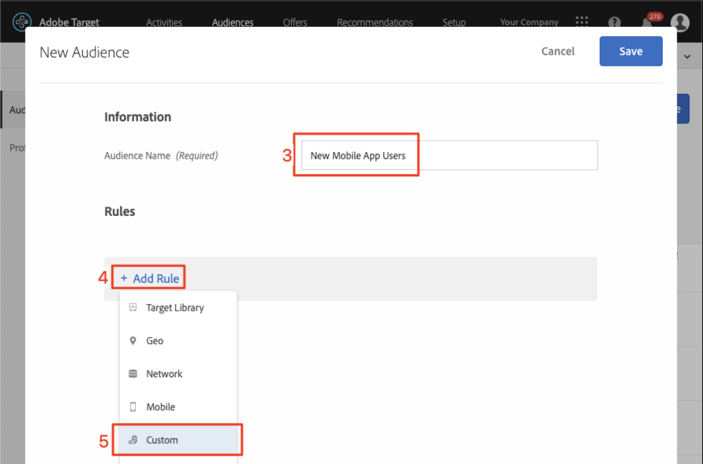

# 在Adobe Target中创建受众和选件

在本课程中，我们将进入[!DNL Target]界面，为您在上一课程中实施的三个位置构建受众和选件。

## 学习目标

在本课程结束时，您将能够：

* 在 Adobe Target 中创建受众
* 在Adobe Target中创建选件

更具体地说，在本课程中，我们将创建完成教程开始时定义的个性化用例所需的受众和选件。 我们希望使用“主页”和“搜索”屏幕来帮助应用程序用户预订行程，我们希望使用“感谢”屏幕根据用户的目的地显示一些相关促销活动。 下表显示了我们在本课程中将为每个位置构建的内容：

| 位置 | 受众 | 产品建议 |
| --- | --- | --- |
| wetravel_engage_home | 新的移动设备应用程序用户 | “选择您的起源和目的地以搜索可用的巴士路线” |
| wetravel_engage_search | 新的移动设备应用程序用户 | “使用筛选器缩小搜索结果的范围” |
| wetravel_engage_home | 返回的移动设备应用程序用户 | “欢迎回来！ 在结账时使用促销代码BACK30可获得10%的折扣。” |
| wetravel_engage_search | 返回的移动设备应用程序用户 | 默认内容 |
| wetravel_context_dest | 目标：圣地亚哥 | “DJ” |
| wetravel_context_dest | 目标：洛杉矶 | &quot;通用&quot; |

## 选择您的Workspace

如果贵公司使用属性和工作区来建立用于个性化应用程序和网站的边界，并且您在上一课程中实施了at_property参数，则在继续本课程之前，您应该首先确保自己位于正确的Workspace中。 如果不使用“属性”和“工作区”，则忽略此步骤。 选择您在上一课中使用的Workspace以复制at_property值：

## 创建受众

现在，让我们创建用于个性化应用程序的受众。

### 为新用户创建受众

Adobe Target Audiences用于标识特定的访客组。 之后，可以将选件定位到这些特定组。 对于前两个位置，我们将使用“新用户”受众：

1. 在顶部导航中单击&#x200B;**[!UICONTROL Audiences]**。
1. 单击&#x200B;**[!UICONTROL Create Audience]**按钮。
   

1. 输入&#x200B;**[!UICONTROL New Mobile App Users]**&#x200B;作为受众名称。
1. 选择&#x200B;**[!UICONTROL Add Rule]**。
1. 选择&#x200B;**[!UICONTROL Custom]**规则。
   

1. 选择&#x200B;**[!UICONTROL a.Launches]**。
1. 选择&#x200B;**[!UICONTROL is less than]**。
1. 输入&#x200B;**5**。
1. 保存新受众。
   

### 为回访用户创建受众

按照以上列出的相同步骤为旧用户创建受众。

1. 将受众命名为&#x200B;_返回移动设备应用程序用户_。
1. 使用&#x200B;**[!UICONTROL a.Launches is greater than or equal to 5]**&#x200B;作为自定义规则。
1. 保存新受众。

   

>[!NOTE]
>
>在[!DNL Target]移动设备SDK中收集的所有生命周期量度和维度都以“a”（例如a.Launches）为前缀，可在下拉菜单的“自定义”选项中使用，并且可用于构建受众。

### 为预订圣地亚哥之旅的用户创建受众

接下来，我们将为We.Travel应用程序提供的某些目标创建几个受众。 在上一课程中，我们在wetravel_context_dest位置请求中作为位置参数传递了目标。 该参数可在下拉菜单的“自定义”选项中使用。

>[!NOTE]
>
>如果您希望在自定义下拉列表中看到的参数未出现在[!DNL Target]界面中，请仔细检查该参数是否确实在请求中传递。 如果已验证该参数是否位于请求中，但尚未延迟加载到[!DNL Target]界面中，则只需键入参数名称并按Enter键即可继续定义受众

1. 将受众命名为&#x200B;_目标：圣地亚哥_。
1. 使用此定义的自定义规则： _locationDest包含San Diego_。
1. 保存新受众。

   

### 为预订洛杉矶旅程的用户创建受众

1. 将受众命名为&#x200B;_目标：洛杉矶_
1. 使用此定义的自定义规则： _locationDest包含Los Angeles_
1. 保存新受众。

## 创建选件

现在，让我们创建选件以显示这些消息。 提醒您，选件是代码/内容的片段，在[!DNL Target]响应中交付。 它们通常在[!DNL Target]用户界面中创建，但也可以通过API或使用与Adobe Experience Manager的体验片段集成来创建。 在移动设备应用程序中，JSON选件很常见。 在本教程中，我们将使用HTML选件，这些选件可用于将任何纯文本内容（包括JSON）交付到应用程序中。

### 为新用户创建选件

首先，让我们为新用户的消息创建选件：

1. 在顶部导航中单击&#x200B;**[!UICONTROL Offers]**。
1. 单击 **[!UICONTROL Create]**。
1. 选择&#x200B;**[!UICONTROL HTML Offer]**。

   

1. 将选件命名为&#x200B;_主页：吸引新用户_。
1. 输入&#x200B;_选择Source和目标以搜索可用总线_&#x200B;作为代码。
1. 保存新选件。

   

### 为旧用户创建选件

现在，让我们为旧用户创建一个选件（第二个选件将是默认内容，将不显示任何内容）：

1. 将选件命名为&#x200B;_主页：回头用户_。
1. 请输入&#x200B;_欢迎回来！ 在结账时使用促销代码BACK30可获得10%的折扣。_&#x200B;作为HTML代码。
1. 保存新选件。

   

### 创建San Diego产品

当“DJ”返回到ThankYou活动时，filterRecommendationBasedOnOffer()函数中的逻辑将显示“Rock Night with DJ SAM”的横幅：

1. 为San Diego命名优惠&#x200B;_促销活动_。
1. 输入&#x200B;_DJ_&#x200B;作为HTML代码。
1. 保存新选件。

### 为前往洛杉矶的用户创建选件

当“通用”返回到ThankYou活动时，filterRecommendationBasedOnOffer()函数中的逻辑将显示“Universal Studios”的横幅：

1. 将选件命名为&#x200B;_洛杉矶促销活动_。
1. 输入&#x200B;_Universal_&#x200B;作为HTML代码。
1. 保存新选件。

## 结论

现在，我们有了受众和选件。 在下一个课程中，我们将构建将位置、受众和选件捆绑在一起的活动，以创建个性化的体验！

**[下一步：“个性化布局”>](personalize-layouts.md)**
