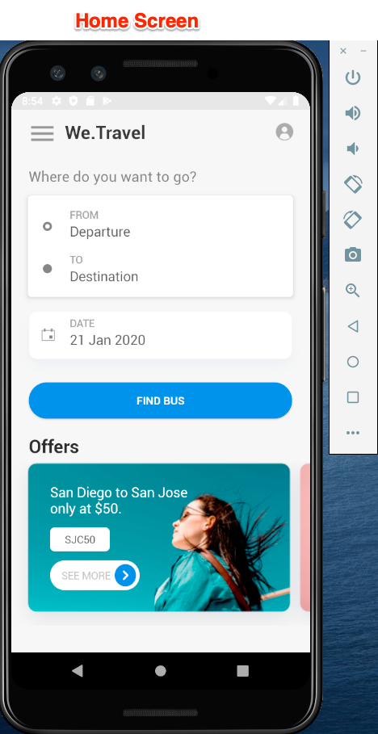

# 下载并更新We.Travel示例应用程序

We.Travel示例应用程序是使用Adobe Mobile Services SDK v4预先实施的。 您只需要更新它，以便它指向您自己的Experience Cloud组织和解决方案帐户。

## 学习目标

在本课程结束时，您将能够：

* 在Android Studio中下载并打开We.Travel示例应用程序
* 验证并更新[!DNL Target]的Mobile Services SDK设置

## 下载We.Travel应用程序

* 下载[sample-app-android-SDKv4-Base-Version.zip](assets/sample-app-android-SDKv4-Base-Version.zip)
* 解压缩zip文件
* 在Android Studio中将应用程序作为现有项目打开（忽略任何有关“无效VCS根映射”的错误）
* 在模拟器中运行应用程序，以确认应用程序已生成，并且您可以看到主屏幕
* 浏览应用程序并确认您可以完成预订流程（选择任何付款选项，然后单击“继续”以跳过计费屏幕！）

  

## 验证并更新[!DNL Target]的Mobile Services SDK设置

根据文档](https://experienceleague.adobe.com/docs/mobile-services/android/getting-started-android/requirements.html?lang=en)，Adobe Mobile Services SDK已在We.Travel应用程序[中预安装。 现在将更新安装以指向您自己的[!DNL Target]帐户。

首先，在Mobile Services用户界面中创建一个新应用程序：

1. 登录到[Adobe Mobile Services界面](https://mobilemarketing.adobe.com/)。
1. 转到[!UICONTROL 管理应用程序]，然后单击&#x200B;**[!UICONTROL 添加]**&#x200B;以添加要与此教程一起使用的新应用程序（**[!UICONTROL 管理应用程序]** > **[!UICONTROL 添加]**）。
1. 选择包含非生产数据的Analytics报表包，为应用程序命名，选择&#x200B;**[!UICONTROL Standard]**&#x200B;类型，然后单击&#x200B;**[!UICONTROL 保存]**。
1. 添加应用后，在下一个屏幕的[!UICONTROL SDK Target选项]部分中添加您的[!DNL Target]客户端代码（您可以在[!DNL Target]界面的&#x200B;**[!UICONTROL 设置]** > **[!UICONTROL 实现]** > **[!UICONTROL 编辑设置]**&#x200B;下找到，位于“下载`at.js`”按钮旁边）。
1. [!UICONTROL 请求超时]设置确定应用程序在执行超时指令之前等待[!DNL Target]服务器响应的时间。 只需保留默认设置。
1. 启用[!UICONTROL 访客ID服务]，并确保在下拉列表中选择了您的[!UICONTROL 组织]。
1. 单击窗口右上角的&#x200B;**[!UICONTROL 保存]**（不是[!UICONTROL 通用链接]、[!UICONTROL 应用程序链接]选项或[!UICONTROL 推送服务]部分中的内容）以保存更改。
1. 滚动到页面底部的应用程序SDK下载部分，并下载配置文件：

   

1. 替换Android Studio项目资产文件夹中的`ADBMobileConfig.json`文件（应用程序> src >主页>资产）。

1. 现在打开`ADBMobileConfig.json`文件并确保它包含预期的更改，如您的[!DNL Target]客户端代码和Analytics详细信息：
   

如果未看到您的设置，请确认您在[!UICONTROL Mobile Services]界面中单击了正确的&#x200B;**[!UICONTROL 保存]**&#x200B;按钮，并将文件复制到正确的位置。

恭喜！ 您已使用[!DNL Target]帐户详细信息更新SDK！ 在下一课程中添加[!DNL Target]请求后，我们将对配置进行其他验证。

**[下一步：“添加Target请求”>](add-requests.md)**
