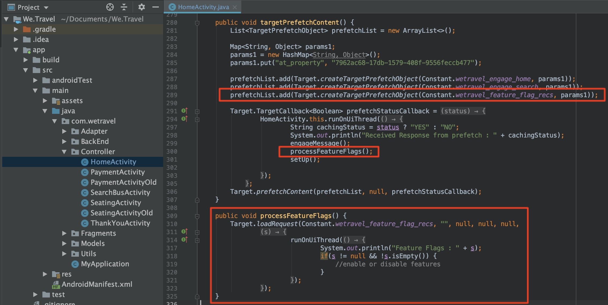
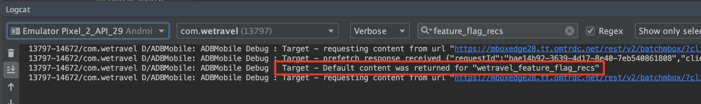
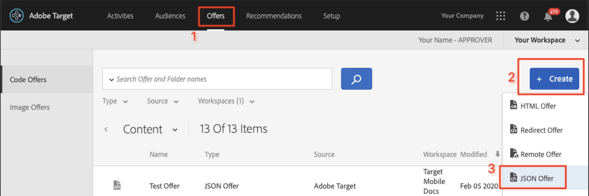
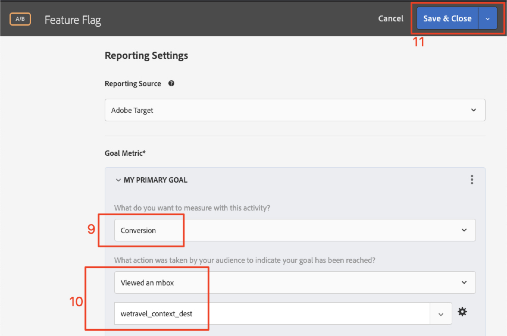

# 功能标记

移动设备应用程序产品所有者需要具备在其应用程序中推出新功能的灵活性，而无需投资于多个应用程序版本。 他们可能还希望逐步将功能推出到用户群的一定比例，以测试有效性。 Adobe Target可用于试用UX的功能，例如颜色、副本、按钮、文本和图像，并将这些功能提供给特定的受众。

在本课程中，我们将创建一个“功能标记”选件，该选件可用作启用特定应用程序功能的触发器。

## 学习目标

在本课程结束时，您将能够：

* 向批量预取请求中添加新位置
* 创建[!DNL Target]活动，其中包含将用作功能标记的选件
* 在您的应用程序中加载并验证功能标记选件

## 向主页活动的预取请求中添加新位置

在之前课程的演示应用程序中，我们将在“主页活动”的预取请求中添加一个名为“wetravel_feature_flag_recs”的新位置，并使用新的Java方法将其加载到屏幕中。

>[!NOTE]
>
>使用预取请求的好处之一是，添加新请求不会添加任何额外的网络开销或导致额外的加载工作，因为该请求将打包在预取请求中

首先，验证wetravelfeatureflagrecs常量是否已添加到Constant.java文件中：


以下是代码：

```java
public static final String wetravel_feature_flag_recs = "wetravel_feature_flag_recs";
```

现在，将位置添加到预取请求中，并加载一个名为`processFeatureFlags()`的新函数：



以下是完整的更新代码：

```java
public void targetPrefetchContent() {
    List<TargetPrefetchObject> prefetchList = new ArrayList<>();

    Map<String, Object> params1;
    params1 = new HashMap<String, Object>();
    params1.put("at_property", "7962ac68-17db-1579-408f-9556feccb477");

    prefetchList.add(Target.createTargetPrefetchObject(Constant.wetravel_engage_home, params1));
    prefetchList.add(Target.createTargetPrefetchObject(Constant.wetravel_engage_search, params1));
    prefetchList.add(Target.createTargetPrefetchObject(Constant.wetravel_feature_flag_recs, params1));

    Target.TargetCallback<Boolean> prefetchStatusCallback = new Target.TargetCallback<Boolean>() {
        @Override
        public void call(final Boolean status) {
            HomeActivity.this.runOnUiThread(new Runnable() {
                @Override
                public void run() {
                    String cachingStatus = status ? "YES" : "NO";
                    System.out.println("Received Response from prefetch : " + cachingStatus);
                    engageMessage();
                    processFeatureFlags();
                    setUp();

                }
            });
        }};
    Target.prefetchContent(prefetchList, null, prefetchStatusCallback);
}

public void processFeatureFlags() {
    Target.loadRequest(Constant.wetravel_feature_flag_recs, "", null, null, null,
            new Target.TargetCallback<String>(){
                @Override
                public void call(final String s) {
                    runOnUiThread(new Runnable() {
                        @Override
                        public void run() {
                            System.out.println("Feature Flags : " + s);
                            if(s != null && !s.isEmpty()) {
                                //enable or disable features
                            }
                        }
                    });
                }
            });
}
```

### 验证功能标记请求

添加代码后，在主页活动上运行模拟器，并查看Logcat以了解更新的响应：



## 创建功能标记JSON选件

我们现在将创建一个简单的JSON选件，该选件将充当特定受众（即将在其应用程序中推出该功能的受众）的标记或触发器。 在[!DNL Target]界面中，创建新选件：



让我们将其命名为“功能标志v1”，其值为{&quot;enable&quot;:1}


## 创建活动

现在，让我们使用该选件创建A/B测试活动。 有关创建活动的详细步骤，请参阅上一课程。 对于此示例，活动只需要一个受众。 在实时方案中，您可能希望为特定功能推广构建特定自定义受众，然后将活动设置为使用这些受众。 在此示例中，我们将仅分配流量50/50（50%给将会看到功能更新的访客，50%给将会看到标准体验的访客）。 以下是活动的配置：

1. 将活动命名为“功能标志”
1. 选择“wetravel_feature_flag_recs”位置
1. 将内容更改为“功能标记v1”JSON选件

   

1. 单击&#x200B;**[!UICONTROL 添加体验]**&#x200B;以添加体验B。
1. 保留“wetravel_feature_flag_recs”位置
1. 将内容保留为&#x200B;**[!UICONTROL 默认内容]**
1. 单击&#x200B;**[!UICONTROL Next]**&#x200B;前进到[!UICONTROL Targeting]屏幕

   

1. 在[!UICONTROL 定位]屏幕上，确认[!UICONTROL 流量分配]方法已设置为默认设置（手动），并且每个体验均具有默认的50%分配。 选择&#x200B;**[!UICONTROL Next]**&#x200B;以前进到&#x200B;**[!UICONTROL 目标和设置]**。

   

1. 将&#x200B;**[!UICONTROL 主要目标]**&#x200B;设置为&#x200B;**[!UICONTROL 转化]**。
1. 将操作设置为&#x200B;**[!UICONTROL Viewed an Mbox]**。 我们将使用“wetravel_context_dest”位置（因为该位置位于“确认”屏幕上，因此我们可以使用它来查看新功能是否会导致更多转化）。
1. 单击&#x200B;**[!UICONTROL 保存并关闭]**。

   

激活活动.

## 验证功能标记活动

现在，使用模拟器来监视请求。 由于我们将定位设置为50%的用户，因此有50%的用户将看到功能标志响应包含`{enable:1}`值。


如果您没有看到`{enable:1}`值，则表示您未被定位到体验。 作为临时测试，要强制显示选件，您可以：

1. 停用活动。
1. 在新功能体验上将流量分配更改为100%。
1. 保存并重新激活。
1. 在模拟器上擦除数据，然后重新启动应用程序。
1. 现在，选件应返回`{enable:1}`值。

在实时方案中，`{enable:1}`响应可用于在您的应用程序中启用更多自定义逻辑，以显示您希望显示目标受众的特定功能集。

## 结论

干得好！ 您现在具备向特定用户受众推广功能所需的技能。
