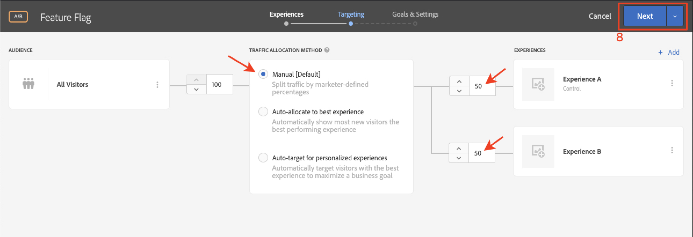

# 功能标记

移动设备应用程序产品所有者需要能够灵活地在其应用程序中推出新功能，而无需投资发布多个应用程序。 他们可能还希望逐步向部分用户群推出功能，以测试有效性。 Adobe Target可用于试验UX功能，如颜色、复本、按钮、文本和图像，并将这些功能提供给特定受众。

在本课程中，我们将创建一个“功能标记”选件，该选件可以用作启用特定应用程序功能的触发器。

## 学习目标

在本课程结束时，您将能够：

* 向批次预取请求添加新位置
* 创建包含选件的[!DNL Target]活动，该选件将用作功能标记
* 在应用程序中加载并验证功能标记选件

## 在“主页”活动的预回迁请求中添加新位置

在我们之前课程中的演示应用程序中，我们将向主页活动中的预取请求添加一个名为“wetravel_feature_flag_recs”的新位置，并使用新的Java方法将其加载到屏幕上。

>[!NOTE]
>
>使用预取请求的好处之一是，添加新请求不会添加任何额外的网络开销或导致额外的加载工作，因为请求已打包在预取请求中

首先，验证是否在Constant.java文件中添加了wetravel_feature_flag_recs常量：


代码如下：

```java
public static final String wetravel_feature_flag_recs = "wetravel_feature_flag_recs";
```

现在，将位置添加到预获取请求中，并加载名为`processFeatureFlags()`的新函数：


以下是完整的更新代码：

```java
public void targetPrefetchContent() {
    List<TargetPrefetchObject> prefetchList = new ArrayList<>();

    Map<String, Object> params1;
    params1 = new HashMap<String, Object>();
    params1.put("at_property", "7962ac68-17db-1579-408f-9556feccb477");

    prefetchList.add(Target.createTargetPrefetchObject(Constant.wetravel_engage_home, params1));
    prefetchList.add(Target.createTargetPrefetchObject(Constant.wetravel_engage_search, params1));
    prefetchList.add(Target.createTargetPrefetchObject(Constant.wetravel_feature_flag_recs, params1));

    Target.TargetCallback<Boolean> prefetchStatusCallback = new Target.TargetCallback<Boolean>() {
        @Override
        public void call(final Boolean status) {
            HomeActivity.this.runOnUiThread(new Runnable() {
                @Override
                public void run() {
                    String cachingStatus = status ? "YES" : "NO";
                    System.out.println("Received Response from prefetch : " + cachingStatus);
                    engageMessage();
                    processFeatureFlags();
                    setUp();

                }
            });
        }};
    Target.prefetchContent(prefetchList, null, prefetchStatusCallback);
}

public void processFeatureFlags() {
    Target.loadRequest(Constant.wetravel_feature_flag_recs, "", null, null, null,
            new Target.TargetCallback<String>(){
                @Override
                public void call(final String s) {
                    runOnUiThread(new Runnable() {
                        @Override
                        public void run() {
                            System.out.println("Feature Flags : " + s);
                            if(s != null && !s.isEmpty()) {
                                //enable or disable features
                            }
                        }
                    });
                }
            });
}
```

### 验证功能标记请求

添加代码后，在主页上运行模拟器，并观察Logcat中是否有更新的响应：


## 创建功能标记JSON选件

现在，我们将创建一个简单的JSON选件，该选件将充当特定受众的标记或触发器 — 在其应用程序中推出该功能的受众。 在[!DNL Target]界面中，创建新选件：


让我们将其命名为“功能标记v1”，其值为{&quot;enable&quot;:1}


## 创建活动

现在，让我们使用该选件创建一个A/B测试活动。 有关创建活动的详细步骤，请参阅上一课程。 对于此示例，活动将只需要一个受众。 在实时场景中，您可能要为特定功能推出构建特定自定义受众，然后设置活动以使用这些受众。 在本例中，我们将仅将流量分配为50/50（50%分配给会看到功能更新的访客，50%分配给会看到标准体验的访客）。 以下是活动的配置：

1. 将活动命名为“功能标记”
1. 选择“wetravel_feature_flag_recs”位置
1. 将内容更改为“功能标记v1”JSON选件

   

1. 单击&#x200B;**[!UICONTROL Add Experience]**&#x200B;添加体验B。
1. 离开“wetravel_feature_flag_recs”位置
1. 保留内容的&#x200B;**[!UICONTROL Default Content]**
1. 单击&#x200B;**[!UICONTROL Next]**&#x200B;进入[!UICONTROL Targeting]屏幕

   

1. 在[!UICONTROL Targeting]屏幕上，验证[!UICONTROL Traffic Allocation]方法是否设置为默认设置（手动），以及每个体验是否具有默认的50%分配。 选择&#x200B;**[!UICONTROL Next]**&#x200B;以前进到&#x200B;**[!UICONTROL Goals & Settings]**。

   

1. 将&#x200B;**[!UICONTROL Primary Goal]**&#x200B;设置为&#x200B;**[!UICONTROL Conversion]**。
1. 将操作设置为&#x200B;**[!UICONTROL Viewed an Mbox]**。 我们将使用“wetravel_context_dest”位置（由于此位置位于“确认”屏幕上，因此我们可以使用该位置来查看新功能是否会导致更多转化）。
1. 单击 **[!UICONTROL Save & Close]**。

   

激活活动。

## 验证功能标记活动

现在，使用模拟器来观察请求。 由于我们已将定位设置为50%的用户，因此有50%的用户会在功能标志响应中看到`{enable:1}`值。


如果您没有看到`{enable:1}`值，则意味着您不是该体验的目标。 作为临时测试，要强制显示选件，您可以：

1. 取消激活活动。
1. 在新功能体验中将流量分配更改为100%。
1. 保存并重新激活。
1. 擦除模拟器上的数据，然后重新启动应用程序。
1. 选件现在应返回`{enable:1}`值。

在实时场景中，`{enable:1}`响应可用于在应用程序中启用更多自定义逻辑，以显示要显示目标受众的特定功能集。

## 结论

做得不错！现在，您已具备将功能转出到特定用户受众所需的技能。
