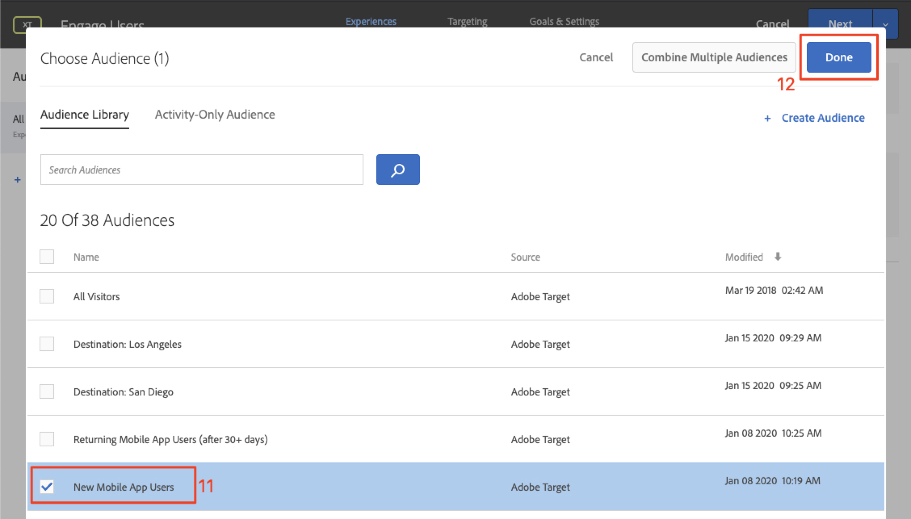
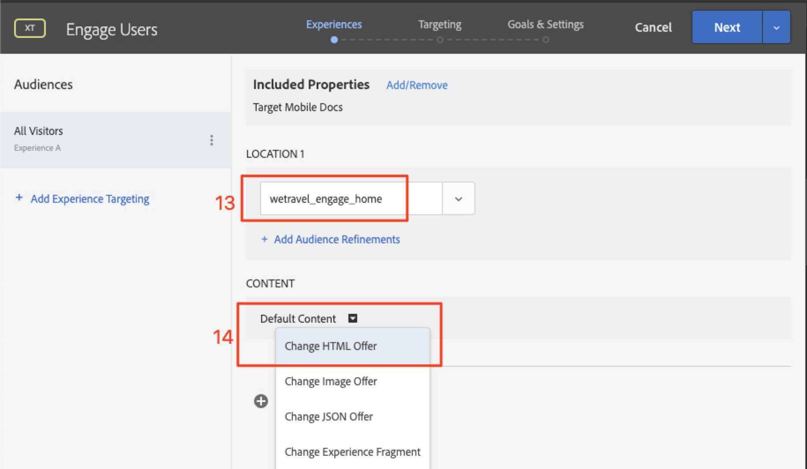
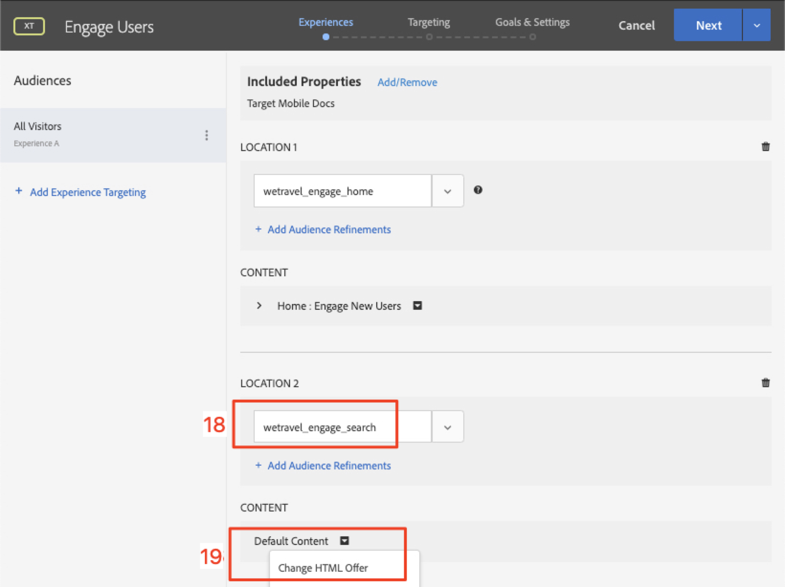
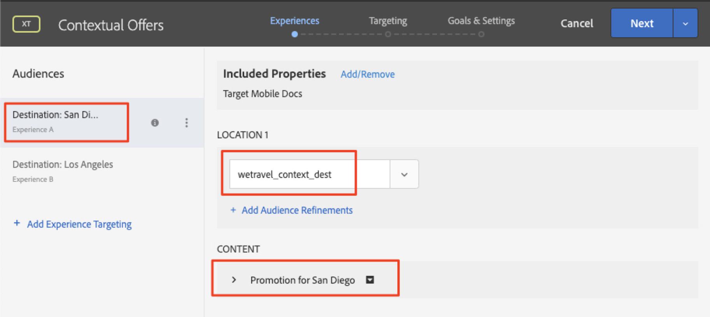
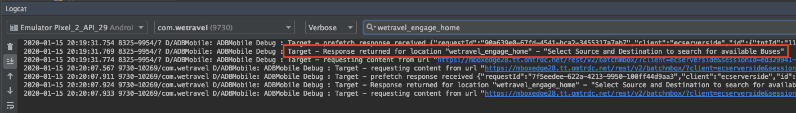

# 个性化布局

现在是时候将所有内容整合在一起并创建个性化体验了。 活动 _是将位_ 置、受众和优惠链接到一起的机制，这样当从应用程序发出请求时，个性化内 [!DNL Target][!DNL Target] 容会做出响应。 我们将在中构建两个个性化活动 [!DNL Target] ，并验证在正确的时间和位置向正确的用户显示个性化内容。

## 学习目标

在本课程结束时，您将能够：

* 在Adobe Target中构建活动
* 验证示例应用程序中的活动

## 以Adobe Target创建活动

了解如何创建吸引用户和上下文优惠活动。

### 第一个活动-“吸引用户”

以下是我们将构建的活动的摘要：

| 受众 | 位置 | 选件 |
|---|---|---|
| 新移动应用程序用户 | wetravel_engage_home、wetravel_engage_search | 主页： 吸引新用户，搜索： 吸引新用户 |
| 返回移动应用程序用户 | wetravel_engage_home、wetravel_engage_search | 主页： 返回用户，default_content |

在界面 [!DNL Target] 中，执行以下操作：

1. 选择 **[!UICONTROL 活动]** > **[!UICONTROL 创建活动]** > **[!UICONTROL 体验定]**&#x200B;位。

   

1. 单击“ **[!UICONTROL 移动应用程序]**”。
1. 选择表 **[!UICONTROL 单书写器]**。
1. 选择工作区（与之前的课程中使用的工作区相同）。
1. 选择您的属性（您在以前的课程中使用的属性）。
1. 单击&#x200B;**[!UICONTROL 下一步]**。

   

1. 将活动标题更改为“ **[!UICONTROL 吸引用户]**”。
1. 选择 **[!UICONTROL 省略号]** > **[!UICONTROL 更改受众]**。
   
1. 将受众设置为 **[!UICONTROL 新移动应用程序用户]**。
1. 单击&#x200B;**[!UICONTROL 完成]**。
   

1. 将位置更 _改为wetravel_engage_home_。
1. 选择“默认内容”旁边的下拉箭头，然后选择“ **[!UICONTROL 更改HTML优惠]**”。

   

1. 选择 **[!UICONTROL 主页： 吸引新用户]** 优惠。
1. 选择 **[!UICONTROL 完成]**。

   

1. 选择 **[!UICONTROL 添加位置]**。
   

1. 选择 _wetravel_engage_search位置_ 。
1. 更改HTML优惠。

   

1. 选择搜 **[!UICONTROL 索： 吸引新用户]** 优惠。
1. 单击&#x200B;**[!UICONTROL 完成]**。

   

您刚刚将受众连接到位置和优惠，为新移动App用户创造个性化体验！ 现在，体验应该如下：

现在为返回移动应用程序用户创建体验：

1. 选择 **[!UICONTROL 左侧的]** “添加体验定位”。
1. 选择受众 **[!UICONTROL 返回移动应用程序用户]**。
1. 选择 **[!UICONTROL 完成]**。
   

现在使用之前配置新体验时所用的相同流程。 返回移动应用程序用户体验的配置应当如下：

让我们继续到安装程序中的下一个屏幕：

1. Click **[!UICONTROL Next]** to advance to the **[!UICONTROL Targeting]** screen.
1. 使用定位的默认设置。 如果您对重叠的受众(如 _New York Users__和First Time Users_)有过体验，您可以在此屏幕上安排优先级顺序。
1. 单击 **[!UICONTROL 下一]** 步以前进 **[!UICONTROL 到“目标和设置”]**。

   

现在，我们完成活动设置：

1. 将主要目 **[!UICONTROL 标设置为]** “转 **[!UICONTROL 化”]**。
1. 将操作设置为“ **[!UICONTROL 已查看mbox]** ” > _wetravel_context_dest_ （由于此位置位于确认屏幕上，因此我们可以使用它来衡量转化率）。

   

1. 将屏幕上的所有其他设置保留为默认值。
1. Click **[!UICONTROL Save &amp; Close]** to save the Activity.
1. 在下一 **[!UICONTROL 屏幕]** 上激活活动。

我们的第一个活动现已实时，可以进行测试！

### 第二活动-“情境优惠”

以下是我们将构建的第二个活动的摘要：

| 受众 | 位置 | 选件 |
| --- | --- | --- |
| 目标： 圣地亚哥 | wetravel_context_dest | 圣迭戈促销 |
| 目标： 洛杉矶 | wetravel_context_dest | 洛杉矶升职 |

对下一个活动重复上述步骤-“情境优惠”。 两种体验的最终配置如下所示：

#### 圣地亚哥

#### 洛杉矶

在“目标和设置”(Goals &amp; Settings)步骤中，我们将“主要目标”(Primary Goal)更改为预订确认屏幕上的位置：

1. 在“ **[!UICONTROL 报告设置]**”下，将“ **[!UICONTROL 主要目标]** ”设 **[!UICONTROL 置为Conversion]**。
1. 将操作设 **[!UICONTROL 置为“已查]** 看的mbox _” >_ wetravel_context_dest(在此活动中，此度量基本上没有意义，因为这也是提供体验的同一位置)。
1. 单击&#x200B;**[!UICONTROL 保存并关闭]**。

在下一个屏幕上激活活动。

现在，我们的第二个活动已经开始实时测试！

## 验证主页优惠

运行模拟器并观察首个优惠在主屏幕底部显示。 如果您是具有5个或更多应用程序启动的返回用户，您将看到显示欢迎 _返回_ 优惠。 如果您是新用户（不到5次启动应用程序），您应当看到新用 _户消息_ :

如果新用户优惠未显示，请尝试为模拟器擦除数据。 这将在您下次启动时将应用程序启动项重置为1。 此操作在“工 **[!UICONTROL 具]** ”> **[!UICONTROL “AVD管理器”下完成]**。 如果Logcat无法正常工作，您可能还需要重新启动Android Studio:

您还可以通过筛选wetravel_engage_home来验证Logcat _中的响应_:

## 验证搜索优惠

选择 **[!UICONTROL San Jose]** 作为 **[!UICONTROL Parvo]** ，选 **[!UICONTROL 择San Diego作为Destination]** Destination ******** ，单击San Jose Find Bus，以搜索可用的巴士。

在结果屏幕上，您应当看到使用 _过滤器消息_ 。 如果您是具有5个或更多个应用程序启动的返回用户，此处不会显示任何消息，因为此位置设置了默认内容（此位置为空）:

## 验证感谢屏幕上的上下文优惠

现在继续进行预订流程：

* 在结果屏幕上选择一个总线。
* 在结帐屏幕上选择一个席位。
* 在付 **[!UICONTROL 款屏幕上]** ，选择“信用卡”（将付款信息留空——不会进行实际的预订）。

由于选择圣地亚哥作为目标，您应在确认 _屏幕上看到_ DJ SAM优惠横幅：

现在，选 **[!UICONTROL 择]** “完成”并尝试以洛杉矶为目的地的其他预订。 确认屏幕应显示Universal _Studios横幅_ :

## 结论

恭喜！ 这就是Adobe TargetSDK 4.x for Android教程的主要部分。 您现在具备在Android应用程序中实施个性化的技能！ 您可以参考此文档和演示应用程序作为将来项目的参考。

下一步： 功能标记是Android中可通过Adobe Target实现的另一个功能。 要了解功能标记，请查看下一课。

**[下一个： 功能标记>](feature-flagging.md)**
