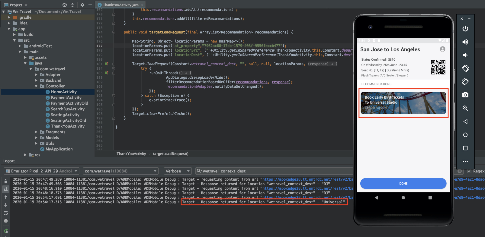

# 个性化布局

现在，是时候将一切整合在一起，创造个性化的体验了。 _活动_&#x200B;是将位置、受众和选件链接在一起的[!DNL Target]机制，以便在从应用程序发出请求时，[!DNL Target]会使用个性化内容进行响应。 我们将在[!DNL Target]中构建两个个性化活动，并验证是否在正确的时间和正确位置向正确的用户显示个性化内容。

## 学习目标

在本课程结束时，您将能够：

* 在Adobe Target中构建活动
* 验证示例应用程序中的活动

## 在Adobe Target中创建活动

了解如何创建Engage Users和上下文优惠活动。

### 第一个活动 — “吸引用户”

以下是我们将构建的活动摘要：

| 受众 | 位置 | 产品建议 |
|---|---|---|
| 新的移动设备应用程序用户 | wetravel_engage_home， wetravel_engage_search | 主页：吸引新用户，搜索：吸引新用户 |
| 返回的移动设备应用程序用户 | wetravel_engage_home， wetravel_engage_search | 主页：旧用户，default_content |

在[!DNL Target]界面中，执行以下操作：

1. 选择&#x200B;**[!UICONTROL Activities]** > **[!UICONTROL Create Activity]** > **[!UICONTROL Experience Targeting]**。

   

1. 单击 **[!UICONTROL Mobile App]**。
1. 选择&#x200B;**[!UICONTROL Form composer]**。
1. 选择您的工作区（在上一课程中使用的相同工作区）。
1. 选择您的资产（与在前面的课程中使用的资产相同）。
1. 单击 **[!UICONTROL Next]**。

   

1. 将活动标题更改为&#x200B;**[!UICONTROL Engage Users]**。
1. 选择&#x200B;**[!UICONTROL ellipsis]** > **[!UICONTROL Change Audience]**。
   
1. 将受众设置为&#x200B;**[!UICONTROL New Mobile App Users]**。
1. 单击 **[!UICONTROL Done]**。
   

1. 将位置更改为&#x200B;_wetravel_engage_home_。
1. 选择“默认内容”旁边的下拉箭头，然后选择&#x200B;**[!UICONTROL Change HTML Offer]**。

   

1. 选择&#x200B;**[!UICONTROL Home: Engage New Users]**&#x200B;选件。
1. 选择&#x200B;**[!UICONTROL Done]**。

   

1. 选择&#x200B;**[!UICONTROL Add Location]**。
   

1. 选择&#x200B;_wetravel_engage_search_&#x200B;位置。
1. 更改HTML选件。

   

1. 选择&#x200B;**[!UICONTROL Search: Engage New Users]**&#x200B;选件。
1. 单击 **[!UICONTROL Done]**。

   

您刚刚将受众连接到位置和选件，从而为新的移动设备应用程序用户创建个性化体验！ 体验现在应当如下所示：

现在，为返回的移动设备应用程序用户创建体验：

1. 选择左侧的&#x200B;**[!UICONTROL Add Experience Targeting]**。
1. 选择受众&#x200B;**[!UICONTROL Returning Mobile App Users]**。
1. 选择&#x200B;**[!UICONTROL Done]**。
   

现在，使用我们之前用于配置新体验的相同流程。 旧版移动设备应用程序用户体验的配置应当如下所示：

让我们继续设置中的下一个屏幕：

1. 单击&#x200B;**[!UICONTROL Next]**&#x200B;进入&#x200B;**[!UICONTROL Targeting]**&#x200B;屏幕。
1. 使用默认设置进行定位。 如果您有重叠受众的体验（例如&#x200B;_New York Users_&#x200B;和&#x200B;_First Time Users_），则可以在此屏幕上排列优先级顺序。
1. 单击&#x200B;**[!UICONTROL Next]**&#x200B;前进到&#x200B;**[!UICONTROL Goals & Settings]**。

   

现在，让我们完成活动设置：

1. 将&#x200B;**[!UICONTROL Primary Goal]**&#x200B;设置为&#x200B;**[!UICONTROL Conversion]**。
1. 将操作设置为&#x200B;**[!UICONTROL Viewed an mbox]** > _wetravel_context_dest_（由于此位置位于确认屏幕上，因此我们可以用它来测量转化）。

   

1. 将屏幕上的所有其他设置保留为默认值。
1. 单击&#x200B;**[!UICONTROL Save & Close]**&#x200B;保存活动。
1. 在下一个屏幕上激活&#x200B;**[!UICONTROL Activity]**。

我们的第一个活动现已上线，准备进行测试！

### 第二个活动 — “上下文优惠”

以下是我们将构建的第二个活动的摘要：

| 受众 | 位置 | 产品建议 |
| --- | --- | --- |
| 目标：圣地亚哥 | wetravel_context_dest | 圣迭戈促销活动 |
| 目标：洛杉矶 | wetravel_context_dest | 洛杉矶促销活动 |

对下一个活动“上下文选件”重复与上述相同的过程。 这两种体验的最终配置如下所示：

#### 圣迭戈

#### 洛杉矶

在“目标和设置”步骤中，我们会将主要目标更改为预订确认屏幕上的位置：

1. 在&#x200B;**[!UICONTROL Reporting Settings]**&#x200B;下，将&#x200B;**[!UICONTROL Primary Goal]**&#x200B;设置为&#x200B;**[!UICONTROL Conversion]**。
1. 将操作设置为&#x200B;**[!UICONTROL Viewed an mbox]** > _wetravel_context_dest_（在此活动中，此量度基本上没有任何意义，因为此位置也是提供体验的位置）。
1. 单击 **[!UICONTROL Save & Close]**。

在下一个屏幕上激活活动。

现在，我们的第二个活动已上线并准备好进行测试！

## 验证主页选件

运行模拟器并观察将在主屏幕底部显示的第一个选件。 如果您是具有5个或更多应用程序启动项的回访用户，则会看到显示的&#x200B;_欢迎回来_&#x200B;选件。 如果您是新用户（启动的应用少于5个），您应该会看到&#x200B;_新用户_&#x200B;消息：

如果未显示新的用户选件，请尝试擦除模拟器的数据。 这会在您下次启动时将应用程序启动次数重置为1。 此操作在&#x200B;**[!UICONTROL Tools]** > **[!UICONTROL AVD Manager]**&#x200B;下完成。 如果Logcat无法正常运行，则您可能需要重新启动Android Studio：

您还可以通过在Logcat中筛选&#x200B;_wetravel_engage_home_&#x200B;来验证响应：

## 验证搜索选件

选择&#x200B;**[!UICONTROL San Jose]**&#x200B;作为您的&#x200B;**[!UICONTROL Departure]**，**[!UICONTROL San Diego]**&#x200B;作为您的&#x200B;**[!UICONTROL Destination]**，然后单击&#x200B;**[!UICONTROL Find Bus]**&#x200B;以搜索可用的总线。

在结果屏幕上，您应该会看到&#x200B;_使用过滤器_&#x200B;消息。 如果您是具有5个或更多应用程序启动项的回访用户，则不会在此处显示消息，因为此位置设置了默认内容（为空）：

## 验证感谢屏幕上的上下文选件

现在，继续完成预订流程：

* 在结果屏幕上选择总线。
* 在结帐屏幕中选择一个名额。
* 在付款屏幕上选择&#x200B;**[!UICONTROL Credit Card]**（将付款信息留空 — 不会进行实际预订）。

由于已选择San Diego作为目标，您应在确认屏幕上看到&#x200B;_DJ SAM_&#x200B;优惠横幅：

现在，选择&#x200B;**[!UICONTROL Done]**&#x200B;并尝试将洛杉矶作为目标进行其他预订。 确认屏幕应显示&#x200B;_Universal Studios_&#x200B;横幅：

## 结论

恭喜！该部分介绍了适用于Android的Adobe Target SDK 4.x教程的主要部分。 您现在拥有在Android应用程序中实施个性化的技能！ 您可以参考此文档和演示应用程序，作为未来项目的参考。

下一步：功能标记是另一个可以在Android中使用Adobe Target实施的功能。 要了解功能标记，请查看下一课程。

**[下一步：功能标记>](feature-flagging.md)**
