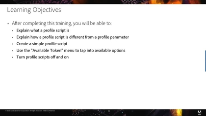

# 了解如何使用Adobe Target

[!DNL Adobe Target] 是 [!DNL Adobe Experience Cloud] 提供定制和个性化客户体验所需的一切功能的解决方案。 [!DNL Target] 帮助您最大限度地提高您的网站和移动站点、应用程序、社交媒体和其他数字渠道的收入。通过这些视频和教程，您可以了解 [!DNL Adobe Target].

>[!NOTE]
>
>除本指南外，还提供了以下 [!DNL Adobe Target] 指南：
>
>* *[Adobe Target 从业者指南](https://experienceleague.adobe.com/docs/target/using/target-home.html?lang=zh-Hans){target=_blank}*
>
>* *[Adobe Target 开发人员指南](https://experienceleague.adobe.com/docs/target-dev/developer/overview.html){target=_blank}*

## 新增功能

以下是新资源：

* **[在中设置A4T报表 [!DNL Analysis Workspace] 表示 [!DNL Auto-Allocate] 活动](integrations/set-up-a4t-reports-in-analysis-workspace-for-auto-allocate-activities.md){target=_blank}**

   *对于业务从业者：的 [!UICONTROL Analytics for Target] (A4T)集成 [!UICONTROL 自动分配] 允许您在 [!DNL Adobe Analytics]，您甚至可以在 [!DNL Analytics].*

* **[在  [!DNL Analysis Workspace]  中为[!UICONTROL 自动定位]活动设置 A4T 报表](integrations/set-up-a4t-reports-in-analysis-workspace-for-auto-target-activities.md){target=_blank}**

   *对于业务从业者：您是否在使用A4T [!UICONTROL 自动定位]? 请按照以下步骤在中配置A4T报表 [!DNL Analysis Workspace] 确保运行时获得预期结果 [!UICONTROL 自动定位] 活动。*

* **[设备上决策](implementation/on-device-decisioning-overview.md)**

   *对于架构师：开始使用 [!UICONTROL 设备内决策] 为消费者提供接近零的延迟体验。*

* **[迁移 [!DNL Target] 从at.js 2.x到 [!DNL Platform Web SDK]](https://experienceleague.adobe.com/docs/platform-learn/migrate-target-to-websdk/introduction.html){target=_blank}**

   *了解如何迁移 [!DNL Target] at.js实施到 [!DNL Adobe Experience Platform Web SDK].*

## 最受欢迎视频

<table>
<tr>
  <td>
    
    

      <a href="https://experienceleague.adobe.com/docs/target-dev/developer/server-side/on-device-decisioning/overview.html">
    <strong>设备上决策概述</strong>
    </a>
    

    <!--- 

    <em>Learn how to implement the Adobe Target extension with a page load request and custom parameters.</em>
    
 --->
  </td>
   <td>
    
    

    <a href="https://experienceleague.adobe.com/docs/target-learn/tutorials/implementation/2.1-intro-to-target-implementation.html">
    <strong>Adobe Target实施简介</strong>
    </a>
    

    <!--- 

    <em> Learn how to implement at.js 2.0 (and later) in SPAs.</em>
    
 --->
  </td>
  <td>
    
    

      <a href="https://experienceleague.adobe.com/docs/target-learn/tutorials/audiences/create-profile-scripts.html">
    <strong>在Adobe Target中创建配置文件脚本</strong>
    </a>
    

    <!--- 

    <em>Learn how to use the Adobe Experience Cloud Debugger to understand your [!DNL Target] implementation. Learn how to quickly view your library configuration, examine requests to make sure that your custom parameters are being passed correctly, turn on console logging, and disable all [!DNL Target] requests, and use the Mbox Trace tool.</em>
    
 --->
  </td>
</tr>
</table>

## 员工挑选

<table>
<tr>
  <td>
    
    

      <a href="https://experienceleague.adobe.com/docs/platform-learn/implement-in-websites/implement-solutions/target.html">
    <strong>使用Adobe Experience Platform标记实施Target</strong>
    </a>
    

    

    <em>了解如何使用页面加载请求和自定义参数实施Adobe Target扩展。</em>
    

  </td>
   <td>
    
    

    <a href="https://experienceleague.adobe.com/docs/target-learn/tutorials/implementation/implement-atjs-20-in-a-single-page-application.html">
    <strong>在 SPA 中实施 at.js 2.0</strong>
    </a>
    

    

    <em> 了解如何在单页应用程序(SPA)中实施Adobe Target的at.js 2.0（及更高版本）。</em>
    

  </td>
  <td>
    
    

      <a href="https://experienceleague.adobe.com/docs/target-learn/tutorials/troubleshooting/troubleshoot-with-the-experience-cloud-debugger.html">
    <strong>使用Experience Cloud Debugger对Target进行故障诊断</strong>
    </a>
    

    

    <em>了解如何使用Adobe Experience Cloud Debugger了解您的 [!DNL Target] 实施。</em>
    

  </td>
</tr>
</table>