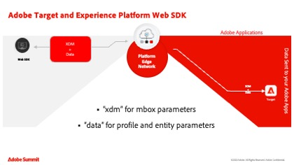
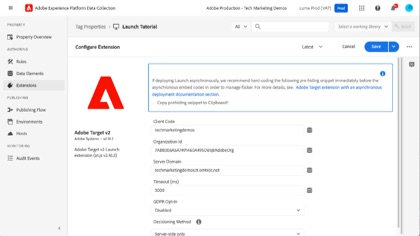

# Adobe Target教程

[!DNL Adobe Target]是[!DNL Adobe Experience Cloud]解决方案，它提供定制和个性化客户体验所需的一切。 [!DNL Target]帮助您最大限度地提高您的网站和移动站点、应用程序、社交媒体和其他数字渠道的收入。 使用这些视频和教程了解[!DNL Adobe Target]的许多组件。

>[!NOTE]
>
>除本指南外，还提供了以下 [!DNL Adobe Target] 指南：
>
>* *[Adobe Target从业者指南](https://experienceleague.adobe.com/docs/target/using/target-home.html?lang=zh-Hans){target=_blank}*
>
>* *[Adobe Target 开发人员指南](https://experienceleague.adobe.com/docs/target-dev/developer/overview.html?lang=zh-Hans){target=_blank}*

## 员工精选

<table style="margin-top: 0 !important">
<tr>
  <td>
    
    

      <a href="https://experienceleague.adobe.com/docs/platform-learn/migrate-target-to-websdk/introduction.html?lang=zh-Hans">
    <strong>将Target从at.js迁移到Platform Web SDK</strong>
    </a>
    

    

    <em>了解如何将at.js实施迁移到Adobe Experience Platform Web SDK。</em>
    

  </td>
  <td>
    
    

      <a href="https://experienceleague.adobe.com/docs/platform-learn/implement-in-websites/implement-solutions/target.html?lang=zh-Hans">
    <strong>使用Adobe Experience Platform标记实施Target</strong>
    </a>
    

    

    <em>了解如何使用页面加载请求和自定义参数实施Adobe Target扩展。</em>
    

  </td>
   <td>
    
    

    <a href="https://experienceleague.adobe.com/docs/target-learn/tutorials/implementation/implement-atjs-20-in-a-single-page-application.html?lang=zh-Hans">
    <strong>在SPA中实施at.js 2.0</strong>
    </a>
    

    

    <em>了解如何在单页应用程序(SPA)中实施Adobe Target的at.js 2.0（及更高版本）。</em>
    

  </td>
</tr>
</table>