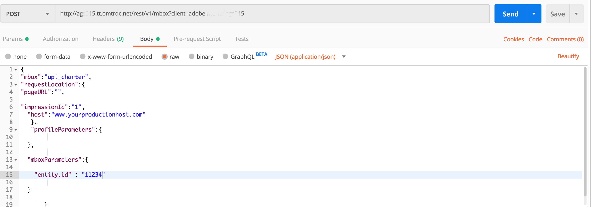

# 正在获取 [!DNL Recommendations] 与交付API

Adobe Target和Adobe Target [!DNL Recommendations] API可用于向网页提供响应，但也可用于不基于HTML的体验，包括应用程序、屏幕、控制台、电子邮件、网亭和其他显示设备。 换句话说，当 [!DNL Target] 库和JavaScript不能使用， **[!DNL Target]交付API** 仍然允许我们访问 [!DNL Target] 功能提供个性化体验。

>[!NOTE]
>
> 在请求包含实际推荐（推荐产品或项目）的内容时，请使用 [!DNL Target] 交付API。

要检索推荐，请发送包含相应上下文信息的Adobe Target交付APIPOST调用，该信息可能包含用户ID（用于特定于配置文件的推荐，如用户最近查看的项目）、相关的mbox名称、mbox参数、配置文件参数或其他属性。 响应将包含推荐的entity.id（并且可能包含其他实体数据），这些实体数据采用JSON或HTML格式，然后可以在设备中显示。

的 [交付API](https://developer.adobe.com/target/implement/delivery-api/)适用于Adobe Target的{target=_blank}公开了标准 [!DNL Target] 请求提供。

>[!NOTE]
>交付API:
>* 使您能够以RESTful方式检索位置和受众的体验或选件。
>* 无需任何身份验证。
>* 仅POST。
>* 不处理Cookie或重定向调用。
>* 不需要或识别“用户角色”。 它只需将内容或报告事件提取到 [!DNL Target] 边缘服务器。

使用交付API进行交付 [!DNL Target] 体验（包括推荐）请按照以下步骤操作：

1. 创建 [!DNL Target] 活动(A/B、XT、AP或 [!DNL Recommendations])来访问Advertising Cloud的帮助。
2. 使用交付API来获取对由 [!DNL Target] 活动。

<!-- Q: Why are BOTH steps necessary for this? If you have a Form-based recommendation defined for an mbox, what's the point/benefit of ALSO having the Delivery API step in to retrieve results? Why can't you just have the Form-based Rec deliver the results in the destination device...?? A: See use case below... it's when you want to "intercept" the pending results in order to do more stuff prior to displaying the results. Things like real-time comparisons to inventory levels. -->

## 使用基于表单的体验编辑器创建推荐

要创建可与交付API一起使用的推荐，请使用 [基于表单的编辑器](https://experienceleague.adobe.com/docs/target/using/experiences/form-experience-composer.html?lang=en).

1. 首先，创建并保存一个基于JSON的设计，以在推荐中使用。 有关示例JSON以及有关配置基于表单的活动时如何返回JSON响应的背景信息，请参阅 [创建推荐设计](https://experienceleague.adobe.com/docs/target/using/recommendations/recommendations-design/create-design.html?lang=en). 在此示例中，该设计名为 *简单JSON。*

   

2. 在 [!DNL Target]，导航到 **[!UICONTROL 活动] > [!UICONTROL 创建活动] > [!UICONTROL Recommendations]**，然后选择 **[!UICONTROL 表单]**.

   

3. 选择资产，然后单击 **[!UICONTROL 下一个]**.
4. 定义希望用户接收推荐响应的位置。 以下示例使用名为 *api_charter*. 选择您之前创建的基于JSON的设计，该设计名为 *简单JSON。*
   
5. 保存并激活推荐。 它将产生结果。 [结果准备就绪后](https://experienceleague.adobe.com/docs/target/using/recommendations/recommendations-activity/previewing-and-launching-your-recommendations-activity.html?lang=en)，则可以使用交付API来检索它们。

## 使用交付API

的语法 [交付API](https://developer.adobe.com/target/implement/delivery-api/#tag/Delivery-API){target=_blank}为：

`POST https://{{CLIENT_CODE}}.tt.omtrdc.net/rest/v1/delivery`

1. 请注意，客户端代码是必需的。 请注意，您的客户端代码可通过导航到 **[!UICONTROL Recommendations] > [!UICONTROL 设置]**. 请注意 **[!UICONTROL 客户端代码]** 值 **[!UICONTROL 推荐API令牌]** 中。
   
1. 获取客户端代码后，构建交付API调用。 以下示例以 **[!UICONTROL Web批量Mbox交付API调用]** 提供于 [交付API Postman集合](https://developers.adobetarget.com/api/delivery-api/#section/Getting-Started/Postman-Collection)，进行相关修改。 例如：
   * the **浏览器** 和 **地址** 对象已从 **正文**，因为非HTML用例不需要使用它们
   * *api_charter* 列为此示例中的位置名称
   * 已指定entity.id，因为此推荐基于内容相似度，该内容相似度要求将当前项目键传递到 [!DNL Target].
      
请记住正确配置查询参数。 例如，请务必指定 
`{{CLIENT_CODE}}` 视需要。 <!--Q: In the updated call syntax, entity.id is listed as a profileParameter instead of an mboxParameter as in older versions. --> <!--Q: Old image  Old accompanying text: "Note this recommendation is based on Content Similar products based on the entity.id sent via mboxParameters." -->
      
1. 发送请求。 此操作针对 *api_charter* 位置，该位置上有一个正在运行的活动推荐，它是通过JSON设计定义的，该设计将输出一个推荐实体列表。
1. 接收基于JSON设计的响应。
   
响应包括键ID以及推荐实体的实体ID。

将交付API与 [!DNL Recommendations] 这样，您就可以在非HTML设备上向访客显示推荐之前执行其他步骤。 例如，您可以利用交付API的响应，在显示最终结果之前，对其他系统（如CMS、PIM或电子商务平台）的实体属性详细信息（库存、价格、评级等）执行额外的实时查找。

使用本教程中概述的方法，您可以获取任何应用程序来利用 [!DNL Target] 提供个性化推荐！

## 实施示例

以下资源提供了各种非HTML重点实施的示例。 请记住，由于涉及的系统和设备，每个实施都将是唯一的。

| 资源 | 详细信息 |
| --- | --- |
| [Adobe Target无处不在 — 在IoT中实施服务器端或](https://expleague.azureedge.net/labs/L733/index.html) | Adobe Summit2019实验室，为利用Adobe Target服务器端API的React应用程序提供动手实践体验。 |
| [Adobe Target中的移动设备应用程序，但不带AdobeSDK](https://community.tealiumiq.com/t5/Universal-Data-Hub/Adobe-Target-in-a-Mobile-App-Without-the-Adobe-SDK/ta-p/26753) | 本指南将向您演示如何在移动设备应用程序中设置Adobe Target，而无需安装AdobeSDK。 此解决方案使用Tealium SDK Webview和远程命令模块向Adobe访客API(Experience Cloud)和Adobe Target API发送和接收请求。 |
| [Adobe Target在移动设备应用程序中的工作原理](https://experienceleague.adobe.com/docs/target/using/implement-target/mobile-apps/mobile-how-target-works-mobile-apps.html?lang=en) | 如何 [!DNL Target] 与Mobile SDK配合使用 |
| [配置 [!DNL Target] 扩展的Experience Platform Launch和实施 [!DNL Target] API](https://aep-sdks.gitbook.io/docs/using-mobile-extensions/adobe-target) | 配置 [!DNL Target] 扩展，添加 [!DNL Target] 扩展到您的应用程序，并实施 [!DNL Target] 用于请求活动、预取选件和进入可视预览模式的API。 |
| [Adobe Target节点客户端](https://www.npmjs.com/package/@adobe/target-nodejs-sdk) | 开源 [!DNL Target] Node.js SDK v1.0 |
| [服务器端概述](https://experienceleague.adobe.com/docs/target/using/implement-target/server-side/api-and-sdk-overview.html?lang=en) | 有关Adobe Target服务器端交付API、服务器端批量交付API、Node.js SDK和Adobe Target的信息 [!DNL Recommendations] API。 |
| [Adobe Campaign电子邮件中的Recommendations内容](https://medium.com/adobetech/adobe-campaign-content-recommendations-in-email-b51ced771d7f) | 介绍如何通过Adobe Campaign中的Adobe Target和Adobe I/O Runtime利用电子邮件中的内容推荐的博客。 |

## 管理 [!DNL Recommendations] 使用API进行设置

大多数情况下，会在Adobe Target UI中配置推荐，然后通过 [!DNL Target] API，原因如上面各节中所述。 这种UI-API协调是常见的。 但是，有时用户可能希望通过API执行所有操作（包括设置和结果的使用）。 虽然不常见，但用户可以绝对地配置、执行、 *和* 完全使用API来利用推荐的结果。

我们在 [前面部分](https://developer.adobe.com/target/before-administer/recs-api/manage-catalog/){target=_blank}如何管理Adobe Target Recommendations实体并在服务器端交付它们。 同样，Adobe I/O允许您管理标准、促销活动、收藏集和设计模板，而无需登录到Adobe Target。 所有 [!DNL Recommendations] 可能会找到API [此处](https://developers.adobetarget.com/api/recommendations/)，但以下是供参考的摘要。

| 资源 | 详细信息 |
| --- | --- |
| [收藏集](https://developers.adobetarget.com/api/recommendations/#tag/Collections) | 列出、创建、获取、编辑和删除收藏集。 |
| [标准](https://developers.adobetarget.com/api/recommendations/#tag/Criteria) | 列出并获取标准。 |
| [设计](https://developers.adobetarget.com/api/recommendations/#tag/Designs) | 列出、创建、获取、编辑、删除和验证设计。 |
| [实体](https://developers.adobetarget.com/api/recommendations/#tag/Entities) | 保存、删除和获取实体。 |
| [促销活动](https://developers.adobetarget.com/api/recommendations/#tag/Promotions) | 列出、创建、获取、编辑和删除促销活动。 |
| [类别标准](https://developers.adobetarget.com/api/recommendations/#tag/Category-Criteria) | 列出、创建、获取、编辑和删除类别标准。 |
| [自定义标准](https://developers.adobetarget.com/api/recommendations/#tag/Custom-Criteria) | 列出、创建、获取、编辑和删除自定义标准。 |
| [项目标准](https://developers.adobetarget.com/api/recommendations/#tag/Item-Criteria) | 列出、创建、获取、编辑和删除项目标准。 |
| [热门程度标准](https://developers.adobetarget.com/api/recommendations/#tag/Popularity-Criteria) | 列出、创建、获取、编辑和删除热门程度标准。 |
| [配置文件属性条件](https://developers.adobetarget.com/api/recommendations/#tag/Profile-Attribute-Criteria) | 列出、创建、获取、编辑和删除配置文件属性条件。 |
| [近期标准](https://developers.adobetarget.com/api/recommendations/#tag/Recent-Criteria) | 列出、创建、获取、编辑和删除最近的标准。 |
| [序列标准](https://developers.adobetarget.com/api/recommendations/#tag/Sequence-Criteria) | 列出、创建、获取、编辑和删除序列标准。 |

## 参考文档

* [Adobe Target管理API文档](https://developer.adobe.com/target/administer/admin-api/){target=_blank}
* [Adobe Target交付API](https://developer.adobe.com/target/implement/delivery-api/){target=_blank}
* [将 [!DNL Recommendations] 与电子邮件集成](https://experienceleague.adobe.com/docs/target/using/recommendations/recommendations-faq/integrating-recs-email.html)

## 摘要和审阅

恭喜！ 通过完成本教程，您学习了如何：
* [使用Recommendations API管理目录](https://developer.adobe.com/target/before-administer/recs-api/manage-catalog/){target=_blank}
* [使用Recommendations API管理自定义标准](https://developer.adobe.com/target/before-administer/recs-api/manage-custom-criteria/){target=_blank}
* [将交付API与Recommendations结合使用](https://developer.adobe.com/target/before-administer/recs-api/fetch-recs-server-side-delivery-api/){target=_blank}
