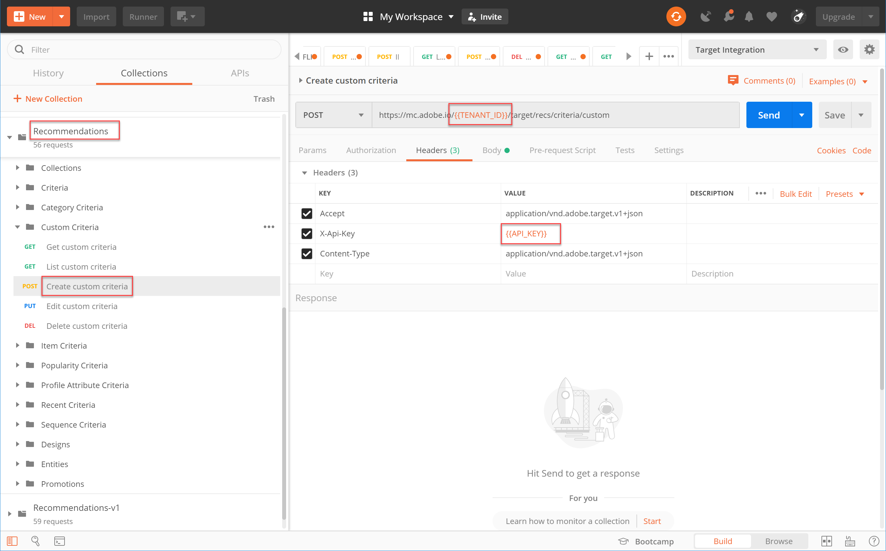

# 管理自定义条件

有时，[!DNL Recommendations]提供的算法无法显示您要提升的特定项目。 在这种情况下，自定义条件为您提供了一种为给定关键项目或类别提供一组特定推荐项目的方式。 定义关键项或类别与推荐项之间的映射，并将该映射作为自定义条件导入。 此过程在[自定义标准文档](https://docs.adobe.com/content/help/en/target/using/recommendations/criteria/recommendations-csv.html)中有介绍。 如该文档中所述，您可以通过[!DNL Target]用户界面(UI)创建、编辑和删除自定义条件。 但是，[!DNL Target]还提供一组自定义条件API，允许对自定义条件进行更详细的管理。

>[!IMPORTANT]
>
>按照以下使用准则自定义标准：
>
> 使用API针对给定的自定义条件执行所有操作（创建、编辑、删除），或者使用UI执行所有操作（创建、编辑、删除）。 通过UI和API的组合管理自定义条件可能会导致信息冲突或意外结果。 例如，在UI中创建自定义条件，然后通过API编辑该条件不会反映您在UI中的更新，即使它将在后端更新（通过API可见）。

## 创建自定义条件

要使用[创建自定义条件API](https://developers.adobetarget.com/api/recommendations/#operation/createCriteriaCustom)创建自定义条件，语法为：

`POST https://mc.adobe.io/{{TENANT_ID}}/target/recs/criteria/custom`

>[!WARNING]
>
>如本练习所述，使用“创建自定义条件API”创建的自定义条件将显示在UI中，它们将一直存在。 您将无法在UI中编辑或删除它们。 您可以通过API **编辑或删除它们**，但无论采用哪种方式，它们都将继续显示在[!DNL Target] UI中。 要保持在UI中进行编辑或删除的选项，请根据文档[创建自定义条件，而不是使用创建自定义条件API。](https://docs.adobe.com/content/help/en/target/using/recommendations/criteria/recommendations-csv.html)

只有在您阅读上面的警告，并且习惯于创建新的自定义条件后，才能继续使用本教程，这些条件随后无法从UI中删除。

1. 验证&#x200B;**的`TENANT_ID`和`API_KEY`是否创建自定义条件**&#x200B;引用先前建立的邮递员环境变量。 请使用下图进行比较。

   

2. 将您的&#x200B;**Body**&#x200B;添加为&#x200B;**raw** JSON，它定义自定义条件CSV文件的位置。 将[创建自定义标准API](https://developers.adobetarget.com/api/recommendations/#operation/getAllCriteriaCustom)文档中提供的示例用作模板，根据需要提供`environmentId`和其他值。 在此示例中，我们使用LAST_PURCHASED作为密钥。

   

3. 发送请求并观察响应，该响应包含您刚刚创建的自定义条件的详细信息。

   

4. 要验证已创建自定义条件，请在Adobe Target内导航至&#x200B;**[!UICONTROL Recommendations] > [!UICONTROL 标准]**，按名称搜索条件，或在下一步中使用&#x200B;**列表自定义条件API**。

   

在这种情况下，我们有一个错误。 让我们使用&#x200B;**列表自定义条件API**&#x200B;更仔细地检查自定义条件，以调查错误。

## 列表自定义条件

要检索所有自定义条件的列表以及每个条件的详细信息，请使用[列表自定义条件API](https://developers.adobetarget.com/api/recommendations/#operation/getAllCriteriaCustom)。 语法为：

`GET https://mc.adobe.io/{{TENANT_ID}}/target/recs/criteria/custom`

1. 像以前一样验证`TENANT_ID`和`API_KEY`并发送请求。 在响应中，请注意自定义条件ID以及前面提到的错误消息的详细信息。
   

在这种情况下，由于服务器信息不正确，因此出现错误，这意味着[!DNL Target]无法访问包含自定义条件定义的CSV文件。 让我们编辑自定义条件以更正此问题。

## 编辑自定义条件

要更改自定义条件定义的详细信息，请使用[编辑自定义条件API](https://developers.adobetarget.com/api/recommendations/#operation/updateCriteriaCustom)。 语法为：

`POST https://mc.adobe.io/{{TENANT_ID}}/target/recs/criteria/custom/:criteriaId`

1. 像以前一样验证`TENANT_ID`和`API_KEY`。
   

1. 指定要编辑的（单个）自定义条件的条件ID。
   

1. 在正文中，提供更新的JSON以及正确的服务器信息。 （对于此步骤，指定对可访问的服务器的FTP访问。）
   

1. 发送请求并记录响应。
   

让我们使用&#x200B;**获取自定义条件API**&#x200B;验证更新的自定义条件是否成功。

## 获取自定义条件

要视图特定自定义条件的自定义条件详细信息，请使用[获取自定义条件API](https://developers.adobetarget.com/api/recommendations/#operation/getCriteriaCustom)。 语法为：

`GET https://mc.adobe.io/{{TENANT_ID}}/target/recs/criteria/custom/:criteriaId`

1. 指定要获取其详细信息的自定义条件的条件ID。 发送请求，并查看响应。
   
1. 验证成功。 （在本例中，请确认没有其他FTP错误。）
   
1. （可选）验证更新是否在UI中正确反映。
   

## 删除自定义条件

使用前面提到的条件ID，使用[删除自定义条件API](https://developers.adobetarget.com/api/recommendations/#operation/deleteCriteriaCustom)删除自定义条件。 语法为：

`DELETE https://mc.adobe.io/{{TENANT_ID}}/target/recs/criteria/custom/:criteriaId`

1. 指定要删除的（单个）自定义条件的条件ID。 单击&#x200B;**发送**。
   

1. 验证是否已使用“获取自定义条件”删除该条件。
   
这种情况下，预期的404错误表示找不到已删除的条件。

>[!NOTE]
>作为提醒，即使删除了[!DNL Target] UI，也不会删除该条件，因为它是使用“创建自定义条件”API创建的。

恭喜！ 您现在可以使用[!DNL Recommendations] API创建、列表、编辑、删除和获取自定义条件的详细信息。 在下一节中，您将使用[!DNL Target]投放API检索推荐。

[下一个“使用服务器端投放API获取Recommendations”>](fetch-recs-server-side-delivery-api.md)
